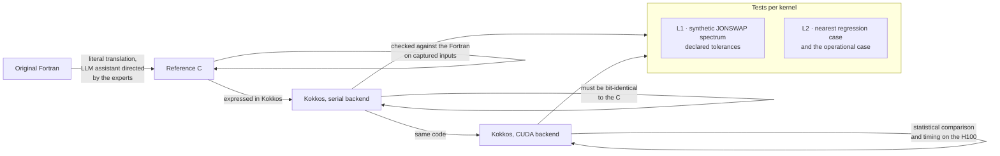
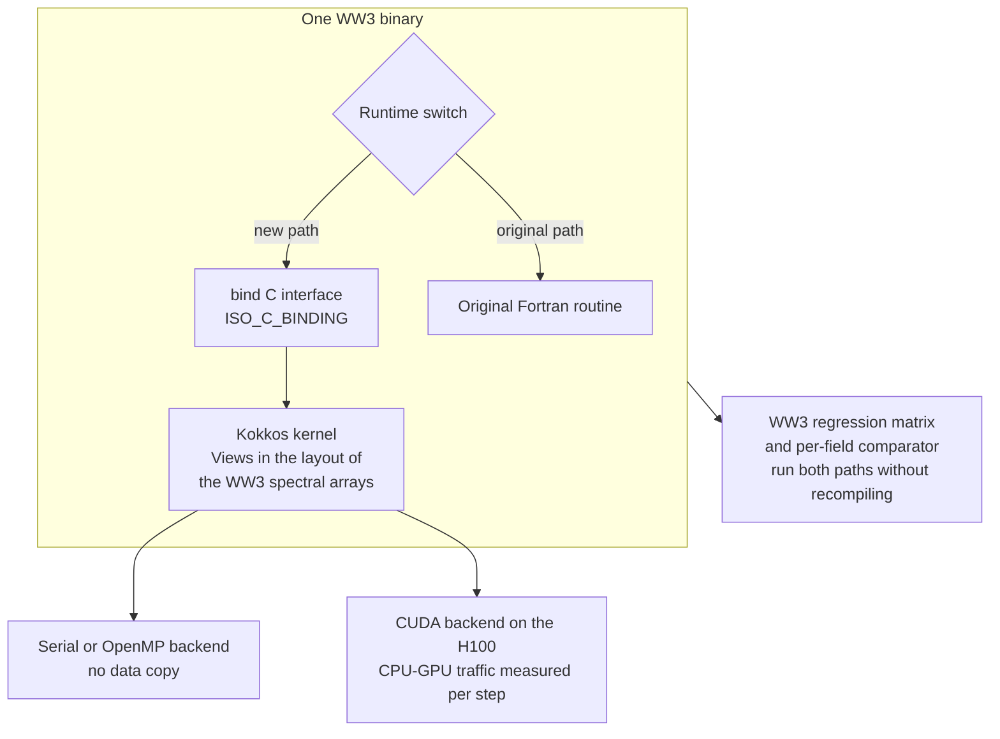
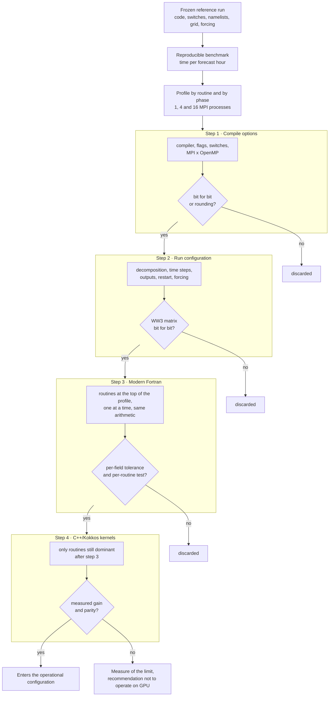
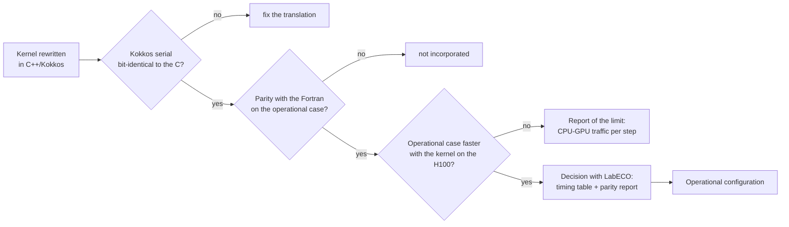

# 13 — Bulk porting with agents

Lesson 12 ported one routine by hand, with a coding agent as the typist. This lesson is
about doing it forty more times without losing what made the first one trustworthy: every
step compared against captured Fortran, every claim with a table attached. The rules come
from `docs/AGENTS_KOKKOS_202609.md` (written to be dropped in as `AGENTS.md`), the plan
from the proposal, and the diagrams from its mind maps (`pubs/proposal/mapas-mentais.pt.md`).

## The FESOM2 recipe

Koldunov et al. (2026) took FESOM2 (about 74 thousand lines of Fortran) to C and then to
C++/Kokkos in **weeks, not years**, with an LLM coding assistant directed by the model's own
experts (`pubs/proposal/pt/05-justification.md` (v); details beyond that summary ⚠). The recipe:

1. **Two stages.** Fortran → a clean, single-threaded C reference → C++/Kokkos. The C stage
   pins the configuration (dead `#ifdef`s disappear) and is what the Kokkos serial backend is compared against.
2. **Literal translation.** Same expressions, order and precision; optimisation is a later, separate change.
3. **A validation ladder.** Each rung compares against the rung below on captured inputs.

The lab collapsed the C stage for `W3SNL1` (100 lines, already CPP-preprocessed `.F90`):
the "bit-identical to the C" rung became "bit-identical to the Fortran fixture on every
preset" (lesson 12). For `W3SRCE` and its 239 preprocessor guards ⚠, keep the C stage.

## What a port PR contains

The six items of lesson 12's definition of done (`AGENTS_KOKKOS` §1.5, §5): kernel with
heritage header; `bind(C)` shim plus Fortran interface; L1 test with justified tolerances;
L2 replay of the smallest regtest; a `PORT_STATUS.md` timing line; a property test where
physics allows. Any algorithmic change is a separate PR with its own L2 evidence (v).

## The ranked list and the phases

`AGENTS_KOKKOS` §2.2 scores each routine by runtime share × Kokkos suitability × ensemble
payoff ÷ (effort + validation risk), with the shares as priors until §2.4's profiling
(lesson 09) re-sorts it (v). Summarised:

| # | Routine(s) | Kokkos shape | Phase |
|---|---|---|---|
| 1 | `W3SNL1` + `INSNL1` | team per point, tables shared; done, lesson 12 | 1 |
| 2 | `W3SRCE` driver | one team per point calling inline device functions; the routine that makes or breaks device residency | 1 skeleton → 2 |
| 3 | `W3SIN4`, `W3SDS4`, `W3SPR4` (or ST6) | inline device functions inside the `W3SRCE` kernel; `team_reduce` for integrals | 1 |
| 4–5 | `W3XYP2` + `W3QCK*`; `W3KTP2/3` | `MDRangePolicy<Rank<3>>` per member with halos via MPI on device buffers; team per point with 1-D sweeps over θ then k | 2 |
| 6 | `W3GATH`/`W3SCAT` | eliminate: one decomposition, device-resident `VA` | 3 |
| 7 | `W3SBT*`, `W3SDB1`, `W3STR1`, `W3SIC*` | trivial once #2 exists | 1–2 |
| 8–9 | output integrals (`w3iogomd`); forcing interpolation (`w3updtmd`) | `parallel_reduce` on device, copy only 2-D fields; the forcing update is simple but triggers the H2D copy | 2 |
| 10 | restart and field I/O | not Kokkos work: async, grouped | 3–4 |

`PDLIB` and the exact/GMD `Snl` variants are explicitly last (v). Phases (§3.6): 0 profile
and ledger; 1 `W3SNL1`, ST4, `W3SRCE` skeleton with copy-in/out, exit on L2 parity on three
regtests; 2 device-resident state; 3 propagation and halos on device; 4 the member
dimension; 5 flip to a C++ driver (v).

## Interoperability, one binary

This is `W3KOKKOSMD` and `WW_KOKKOS_SNL1` from lesson 12, drawn; "measured per step" is `ww_bench_snl1`'s shim-versus-kernel gap.

## The data-residency ladder

`AGENTS_KOKKOS` §3.4 (v), the plan for making the phase-1 copy disappear:

| Step | On the device | Crosses per time step | Effect |
|---|---|---|---|
| 1 | nothing persistent; `VA` copied in and out per call | full spectra, twice | correctness only; may be slower than Fortran |
| 2 | `VA`, grid metadata, tables; source terms on device | forcing (small), output fields (small) | source-term speed-up realised |
| 3 | + propagation with device halo buffers | halos, forcing, output | transposes gone; Fortran only sequences calls |
| 4 | + member dimension | same, batched | ensemble throughput |

Step 2 is where the OpenACC port of Ikuyajolu et al. (2023) stalled, because the state
lived in Fortran modules; WAM6-GPU (Yuan et al. 2024) went the other way, refactoring the
whole model so the fields stay on the device, and reported an order-of-magnitude gain on
a multi-GPU node (`pubs/proposal/pt/05-justification.md` (v)). The plan does step 2 in C++
ownership (a state object created by `ww_kokkos_init`, seeded by the `Ctx` in
`snl1_shim.cpp` with its persistent buffers) rather than mirroring the modules (v).

## The ladder and its gates

Lessons 09, 10 and 12 are rungs; the gates are the matrix, `nccmp-tol` and the fixture tests. An agent may work on any rung; it may not skip one.

## The operation decision

Two documents, one meeting: the timing table of the operational case with and without the
kernel, and the parity report. If the H100 does not win, the deliverable is the measured limit and a recommendation *not* to operate on the GPU (`pubs/proposal/pt/07-methodology.md` (v)).

## Prompting an agent: patterns and anti-patterns

Give it, every time (`AGENTS_KOKKOS` §1.6 (v)): the exact routine with file path and WW3
commit; the regtest that exercises it and the reference output; the interface contract
(which arrays cross, in which layout, which precision); and the phase, so it knows which
optimisations are off limits. The document's own example is the prompt behind lesson 12:
"Port `W3SNL1` (DIA) from `model/src/w3snl1md.F90` @ WW3 7.14 … Phase 1: translate only …
Write L1 test against a JONSWAP fixture … Do not touch the Fortran caller except to add
the `bind(C)` interface behind the `WW_KOKKOS_SNL1` switch."

Forbid explicitly (v): optimising while translating; replacing preprocessor switches with
runtime `if`s inside kernels; claiming a speed-up without an attached timing table;
editing WW3 physics to "make interop easier"; introducing Unified Memory to avoid
thinking about transfers. And require it to *ask* before changing a loop order that
affects reduction order, a precision, a limiter or an integration scheme (§5).

Two lab-specific lessons from the first port (`kokkos/README.md` (v)): an agent reaches
for `std::pow` where gfortran multiplies, and for a fused multiply-add where the Fortran
rounds twice. Neither is wrong C++; both fail a 1e-5 parity test. Build the fixture first.

## WW4: do not compete, build in its shape

WAVEWATCH IV is NOAA's rewrite (plan: Office Note 525, 2025; Phase II, languages,
governance, architecture, closed March 2026, Office Note 528). As of 2026-09-15 it has a
C++ core with no physics, L1 and L2 tests in GoogleTest of four planned levels, and an open
CPU–GPU architecture question with Kokkos proposed as the abstraction layer
(`pubs/proposal/pt/05-justification.md` (v); [lesson 14](14-ww4-and-the-future.md)). ON 525
retires WW3 only once WW4 matures, so WW3 stays operational for years. The project's
artefacts are shaped to be reusable there (L1 per-kernel tests on synthetic spectra, L2
replays, GoogleTest, heritage headers) without contributing to WW4 or depending on it
(`pubs/proposal/pt/04-scope.md` (v)). Licence (`AGENTS_KOKKOS` §4): the translated kernels
derive from WW3, so `snl1_dia.cpp`, `snl1_tables.cpp` and the Fortran module that patches
into the model, `w3kokkosmd.F90`, carry `LGPL-3.0-or-later`; the C++ tooling around them,
`snl1_shim.cpp` and the C header included, is MIT (v); and nothing here is called WW4.

## Sources

- Koldunov et al. (2026), FESOM2 Fortran → C → C++/Kokkos: https://doi.org/10.48550/arXiv.2606.11356
- Ikuyajolu et al. (2023), *GMD* 16, 1445–1458: https://doi.org/10.5194/gmd-16-1445-2023
- Yuan et al. (2024), WAM6-GPU v1.0, *GMD* 17, 6123–6136: https://doi.org/10.5194/gmd-17-6123-2024
- NCEP Office Note 525 (2025): https://doi.org/10.25923/h7j3-1h25; Office Note 528, Tolman (2026): https://doi.org/10.25923/0wyp-9f39; keys in `pubs/proposal/refs.bib`

→ [`14-ww4-and-the-future.md`](14-ww4-and-the-future.md), or [`15-swan.md`](15-swan.md).
