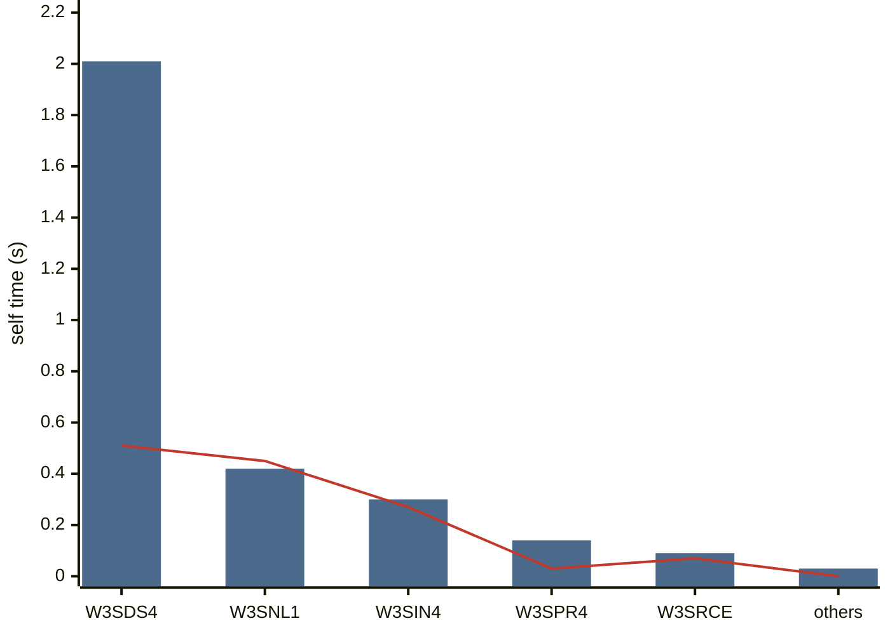
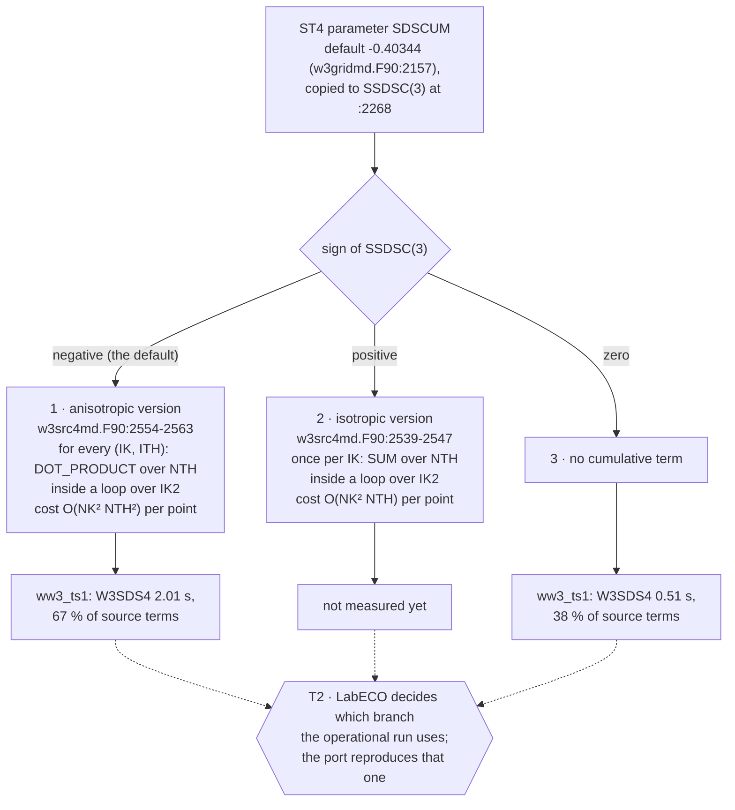
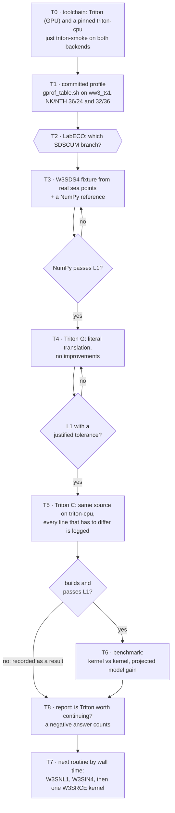
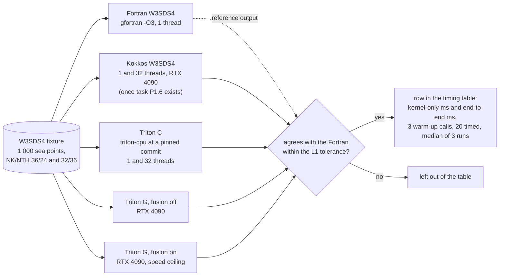
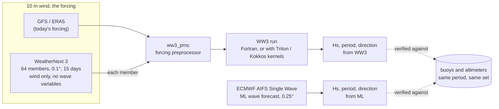

# W3SDS4 and the Triton arms, in figures

Companion to issue [#45](https://github.com/h0ffmann/ww3-gpu/issues/45), which is the plan and
the source of truth: the execution bottleneck of WW3 (`W3SDS4`, ST4 dissipation), its port to
Triton on CPU and GPU, the benchmark against Fortran and Kokkos, and WeatherNext 3 as wind input.
These five figures summarise that issue as it stood on 2026-10-07; where they and the issue
disagree, the issue wins and the figure is a bug. `(v)` and `⚠` keep their usual meaning.

## Where the source-term time goes

How to read this figure

**Takeaway.** In this test, the routine that dissipates wave energy by breaking (`W3SDS4`) takes two thirds of the source-term time, about five times the nonlinear interaction (`W3SNL1`); with its cumulative-breaking term switched off it costs a quarter as much.

**How to read.** One blue bar per routine: self time in seconds with ST4 at its default settings (`W3SRCE` is its own time, without the routines it calls; *others* is `W3SLN1`, `W3SDB1`, `W3SBT1` and `CALC_USTAR`). The red line is the same routines with `SDSCUM=0`, which removes the cumulative term; where the line sits far below the bar, that term is the cost.

**Not shown.** Propagation, MPI, gather/scatter and output: `ww3_ts1` is a single-point source-term test (3×3 grid, NK=36, NTH=24). The operational grid is NK=32, NTH=36, and the cumulative term grows with NTH², so the gap should widen there ⚠.

**Evidence.** `docs/data/ww3_ts1_gprof_202610.md`, the gprof table of #45 (`WW3@761cf79d`, gfortran 16.2, `-O3 -pg`), transcribed ⚠: task T1 replaces it with committed `kokkos/tools/profile/gprof_table.sh` output. The chart is generated from that file (`python3 scripts/figures.py chart …`, the `%% data:` line) and CI fails if the two drift.

## Why `SDSCUM` decides the cost

How to read this figure

**Takeaway.** One number in the ST4 settings picks one of three versions of the same term, and the default picks the most expensive one, which WW3's own comment calls "the expensive and largely useless version".

**How to read.** Top to bottom. The diamond tests the sign of the parameter; each numbered box is the code that sign selects, with its line numbers and how its cost grows with the spectral grid (NK frequencies, NTH directions). The boxes below give the measured time where there is one. The dashed arrows lead to the decision, the hexagon, which only the LabECO research group can take, because all three versions change the physics.

**Not shown.** The rest of `W3SDS4` (saturation-based dissipation, wave–turbulence interaction), which every branch runs; and `DIKCUMUL`, the frequency offset below which the term is skipped.

**Evidence.** `WW3@761cf79d`: `model/src/w3gridmd.F90:2157` and `:2268`, `model/src/w3src4md.F90:2539-2547` and `:2554-2563` (v, read 2026-10-08). Timings: `docs/data/ww3_ts1_gprof_202610.md` ⚠ (transcribed from #45).

## The port, task by task

How to read this figure

**Takeaway.** The slowest routine is rewritten for a new GPU language in small, checked steps, and nothing is timed until its answers match the original within a stated tolerance.

**How to read.** Top to bottom, in the order of the tasks in #45 (T7 comes last because it starts the next routine). Rectangles are work, diamonds are pass/fail gates (a *no* sends the step back to be fixed), and the hexagon is a decision only the research group can take. On the CPU backend a failure to build or to pass is itself a result, so it goes straight to the report.

**Not shown.** The open technical risks listed in #45: transcendental functions that make bit-for-bit agreement on the GPU unlikely, FMA contraction (`enable_fp_fusion=False` ⚠), `tl.dot` changing the order of a reduction (ask before), and the lack of a Fortran shim until Triton's ahead-of-time compiler is used ⚠.

**Evidence.** Issue #45, sections *Tarefas* and *O que deve dar trabalho* (v, 2026-10-07); port order by wall time, `CONTRIBUTING.md` "Port order is wall time" (PR #46).

## What the benchmark compares

How to read this figure

**Takeaway.** Five versions of the same routine get the same input, and only those whose results agree with the original Fortran are allowed into the speed comparison.

**How to read.** Left to right. The cylinder is the shared input. Each rectangle in the middle is one implementation (an "arm") with its build and hardware. The Fortran arm also provides the reference output (dashed arrow) that the diamond checks every other arm against; *yes* puts its timing in the table, *no* keeps it out.

**Not shown.** The whole-model run (`just bench-case`, `bench/bench_ww3_cpu.sh`), where the gain is a projection until a kernel runs inside WW3; the H100 rows; and Triton G's JIT compile time, which is reported apart from the median.

**Evidence.** Issue #45, *Como medir* §1 (v, 2026-10-07); timing protocol as in `kokkos/tests/bench_snl1.cpp` (v); in `W3SNL1` on Kokkos CUDA the host↔device copy is 94 % of a call, which is why end-to-end is reported next to kernel-only (`kokkos/PORT_STATUS.md`, v).

## Where WeatherNext 3 enters

How to read this figure

**Takeaway.** WeatherNext 3 does not forecast waves: it supplies the wind that drives WW3, so the same wave model can be run with a different wind, and each of its 64 ensemble members becomes one WW3 run. The machine-learning wave forecast in the comparison is ECMWF's AIFS Single Wave.

**How to read.** Left to right. The group on the left holds the two wind sources; either one goes through the same preprocessor into the same WW3. The AIFS row is a separate wave forecast that needs no WW3. Dashed arrows are verification: both sets of wave fields are scored against the same observations over the same period.

**Not shown.** Data access (BigQuery, Earth Engine or GCS after a request form), licences and cost ⚠, and WeatherNext 3's own run time, which has not been published ⚠.

**Evidence.** Issue #45, *Como medir* §3 (v, 2026-10-07), which cites the WeatherNext model and access guides and the ECMWF AIFS Single Wave dataset page.

