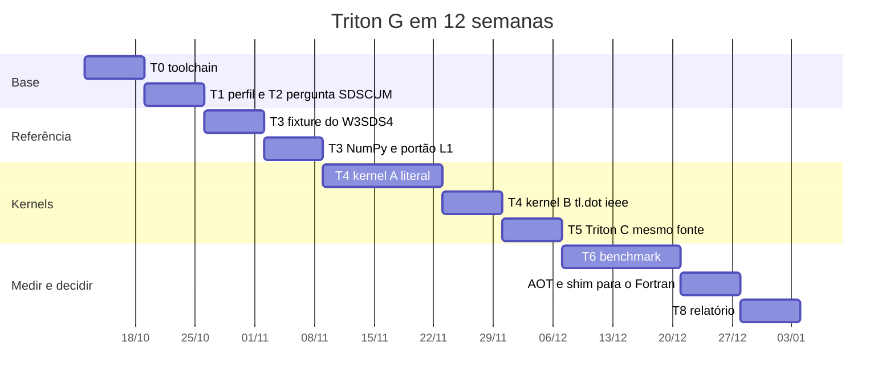

# Port do `W3SDS4` para Triton C e Triton G: plano incremental e o peso entre CPU e GPU num H100

Complemento da issue [#45](https://github.com/h0ffmann/ww3-gpu/issues/45) e da página de figuras
[`W3SDS4_TRITON_202610.md`](W3SDS4_TRITON_202610.md). A issue continua sendo a fonte de verdade das
tarefas T0 a T8. Este texto responde ao que ela deixou em aberto: como fazer o port em passos
pequenos, quanto do WW3 vale levar à GPU e a partir de quando o estado inteiro precisa morar nela,
o que esperar do Triton C em acurácia, o que muda ao trocar o vento do IFS pelo do WeatherNext 3, e
se alguma dessas respostas altera a proposta de graduação.

Escrito em 2026-10-08. `(v)` marca o que foi conferido nessa data, com arquivo e linha ou URL; `⚠`
marca o que não foi. Nenhum kernel Triton foi executado neste repositório. Todo número de GPU
abaixo vem do port Kokkos da DIA (`kokkos/PORT_STATUS.md`) ou é uma projeção, identificada como tal.
Onde o texto fala em "caso regional", usa a estimativa do `KOKKOS_H100_PLAN_202609.md` §6: 160 mil
pontos de mar e NK=32, NTH=36 (NSPEC = 1 152) ⚠, porque a configuração operacional do LabECO
ainda não foi entregue (`pubs/proposal/pt/04-scope.md`).

## Resumo

1. **O alvo certo da GPU é o `W3SRCE` inteiro, não o `W3SDS4`.** Portar o `W3SDS4` sozinho serve
   para validar o kernel. Como caminho de produção ele repete o resultado da ORNL (1,3× por nó),
   porque o espectro atravessa o PCIe a cada subpasso: na DIA em Kokkos CUDA a cópia é 94 % da
   chamada `(v, kokkos/PORT_STATUS.md)`.
2. **A decisão sobre `SDSCUM` vem antes de qualquer kernel.** Com `SDSCUM=0` o `W3SDS4` cai de
   2,01 s para 0,51 s no `ww3_ts1` e os termos-fonte caem 55 % `(v, #45)`. É uma mudança de física,
   e por isso é do LabECO, mas é o maior ganho de tempo de parede disponível sem escrever código.
3. **O Triton não é uma rota de port do WW3; é um kernel.** O alvo do braço Triton G é o termo
   cumulativo do `W3SDS4`, que é um GEMM contra a tabela `CUMULW`, medido contra o kernel Kokkos
   da mesma rotina. O kernel literal por ponto existe só como base de paridade dentro do Triton, e
   o portão de existência do braço é o AOT com chamada do Fortran, na semana 11: sem ele, o Triton
   fica como comparação de kernel. Cabe em 12 semanas. **Triton C** entra como gêmeo de paridade
   na CPU, não como caminho operacional: o fork se declara "work in progress", com
   suporte a CPU "under development" `(v, README do triton-lang/triton-cpu)`.
4. **Bit a bit entre Triton e Fortran é improvável**, na GPU e na CPU: funções transcendentais,
   contração em FMA, ordem das reduções e o TF32 que `tl.dot` usa por padrão em FP32 `(v, triton-lang.org)`.
   O gate é o mesmo do Kokkos: L1 com tolerância escrita e L2 por campo no Hs.
5. **Vento:** o IFS continua sendo a forçante operacional. O WeatherNext 3 entra como segundo braço
   em hindcast, sob CC BY 4.0, para medir o Hs contra observações e para gerar a carga de 64 membros
   que justifica o port. Dado em tempo real sob termos experimentais não vai para a operação.
6. **No H100, o espectro do caso regional ocupa 737 MB em FP32** e cabe 64 vezes nos 80 GB. O
   estado residente é obrigatório a partir da fase 2 e um erro na fase 1, quando o que importa é
   validar uma chamada de cada vez.
7. **A proposta não muda de objetivo, de rota nem de cronograma.** Três frases do método merecem
   ajuste (seção 11). Triton e WeatherNext ficam fora dela.
8. **Os agentes da NVIDIA ajudam no fluxo, não no kernel, e já são gratuitos.** O NOOA do PR #25
   serve de harness para F1 a F3; nos dois estudos disponíveis o modelo aberto é o que falha na
   tradução do Fortran. O único caminho para horas de H100 sem custo, o Academic Grant Program, é
   pedido pelo orientador e está fechado desde 30/06/2026 `(v, seção 10)`.

## 1. O que já está medido

| Medida | Valor | Fonte |
|---|---|---|
| `W3SDS4` no `ww3_ts1`, ST4 padrão | 2,01 s de 2,98 s nos termos-fonte (67 %) | `docs/data/ww3_ts1_gprof_202610.md` ⚠ transcrito de #45; T1 commita o comando |
| O mesmo com `SDSCUM=0` | 0,51 s de 1,33 s (38 %) | idem |
| Custo por chamada do `W3SRCE` (todos os subpassos) | 2,98 s / 14 401 = 0,21 ms; `W3SDS4` 0,14 ms | derivado dos dois números acima, NK=36/NTH=24 |
| `W3SRCEMD` no WW3 6.07, 300 ranks, Summit | ~82 % do tempo; `Sds` > 40 % | Ikuyajolu et al. 2023 `(v, #45)` |
| Ganho da ORNL com OpenACC só nos termos-fonte | ~1,3× por nó, limitado por transferência | idem |
| DIA em Kokkos, 1 000 pontos, RTX 4090 | kernel 0,047 ms; com cópias 0,75 ms; serial 24,96 ms | `(v, kokkos/PORT_STATUS.md)` |
| Divergência causada só pela fusão em FMA | 1,1e-5 relativa | `(v, kokkos/PORT_STATUS.md)` |
| FESOM2: primeira rodada em GPU | 3,8× mais lenta até o estado ficar residente | `(v, KOKKOS_H100_PLAN_202609.md §5)` |

Reproduzir a primeira linha: o comando ainda não existe no repositório; a tarefa T1 cria
`kokkos/tools/profile/gprof_table.sh` e o roda no `regtests/ww3_ts1` com `ww3_grid_ST4_T475.nml`
(NK=36, NTH=24, `DTMIN=15` s `(v, regtests/ww3_ts1/input/ww3_grid_ST4_T475.nml:19-74)`).

## 2. Anatomia do custo e o que ela impõe ao kernel

O termo cumulativo anisotrópico é um produto matriz-vetor por ponto. Em `INSIN4`, a tabela
`CUMULW(IS2,IS)` é preenchida uma vez por grade, só para `IK2 ≤ IK − DIKCUMUL`, e zerada fora
disso `(v, w3src4md.F90:1252-1275 em WW3@761cf79d)`. Em `W3SDS4`, para cada `(IK,ITH)` com
`SSDSC(3) < 0`, a frequência de renovação é a soma de `CUMULW(IS2,IS) · BRLAMBDA(IS2)` sobre os
`IS2` cujo `BTH0(IK2) > SSDSBR` `(v, :2554-2563)`. Ou seja, para um lote de P pontos:

```
RENEWAL[P, NSPEC] = M[P, NSPEC] · CUMULW[NSPEC, NSPEC]
M = BRLAMBDA com as linhas de IK2 reprovadas em BTH0 zeradas
```

Isso tem três consequências para o Triton.

- **É o formato de `tl.dot`**, que é onde o Triton rende. Mas `tl.dot` em FP32 usa TF32 por padrão
  em placas com Tensor Cores, e a documentação avisa que a entrada pode ser truncada sem
  arredondamento `(v, triton-lang.org, triton.language.dot)`. A versão de paridade precisa de
  `input_precision="ieee"`; a versão TF32 só entra na tabela como teto de velocidade.
- **A ordem da soma muda.** O `DOT_PRODUCT` do Fortran soma em sequência; `tl.dot` e `tl.sum`
  somam em árvore. Mudar ordem de redução exige perguntar antes (`AGENTS_KOKKOS` §1.5). O plano
  tem por isso duas variantes do kernel: A, laços literais, para paridade; B, `tl.dot`, para
  velocidade.
- **O tamanho da tabela é fixo por grade** e cabe na GPU uma vez só: 3,0 MB em 36/24, 5,3 MB em
  32/36, 13 MB na grade padrão do WW4 (NSPEC = 1 800). O custo por ponto e subpasso é NSPEC²
  multiplicações-somas: 0,75 M, 1,3 M e 3,2 M, respectivamente.

Duas restrições do Triton que o Kokkos não tem. `tl.arange` só aceita intervalos com tamanho
potência de dois `(v, documentação do tl.arange)`: NTH=24 vira bloco de 32 (25 % de lanes ociosas),
NTH=36 vira 64 (44 %), e NSPEC 1 152 vira 2 048. O efeito no tempo é para medir, não para estimar
⚠. E os kernels são lançados de Python; o caminho para o Fortran é o compilador AOT
(`python/triton/tools/compile.py`), que embute o binário em C e gera o lançador
`(v, github.com/triton-lang/triton, compile.py)`. O script resolve o alvo por `triton.backends`,
com exemplos para CUDA e HIP; não há notícia de um template para o backend de CPU ⚠.

O resto do `W3SDS4` (saturação com `SATINDICES`/`SATWEIGHTS`, `EXP`, `LOG`, `TANH`, `ATAN2`,
whitecaps só quando a saída pede) é um laço por `IK` com vetores de tamanho NTH. É a parte fácil
de traduzir e a parte difícil de reproduzir bit a bit, pela libm.

## 3. Triton G em doze semanas

Um braço de pesquisa, sem compromisso com a operação, e com o enquadramento que #45 passou a ter
em 08/10/2026: o Triton não porta "partes do WW3". O código escalar por ponto do `W3SDS4` e do
`W3SRCE` (subpassos, limitador, ramos) não ganha nada com uma linguagem de kernels por blocos, e
ganha restrições (`tl.arange` em potência de dois, TF32 e fusão em FMA por padrão, nenhuma chamada
nativa a partir do Fortran). O que o Triton tem a oferecer é o termo cumulativo, um GEMM contra
`CUMULW`; o kernel B é o objeto do braço, o kernel A é a base de paridade, e a rota do modelo
continua sendo o Kokkos. Cada semana termina num portão; a semana seguinte só começa quando o
portão passa, e um portão que não passa é um resultado que vai para o relatório.

| Semana | Tarefa de #45 | Entrega | Portão |
|---|---|---|---|
| 1 | T0 | `devShell` `triton` no Nix com Triton 3.x e um commit fixado do triton-cpu; `just triton-smoke` | soma de vetores idêntica nos dois backends |
| 2 | T1, T2 | `gprof_table.sh` commitado e rodado em 36/24 e 32/36; pergunta sobre `SDSCUM` enviada ao LabECO com as três opções e o custo de cada uma | tabela no `PORT_STATUS.md` com o comando |
| 3 | T3 | gancho de captura no Fortran (como `kokkos/tests/fixtures/`): entradas do `W3SDS4` (`A`, `K`, `CG`, `USTAR`, `USDIR`, `DEPTH`, `DAIR`), as tabelas de grade (`SSDSC`, `CUMULW`, `SATINDICES`, `SATWEIGHTS`, `DCKI`, `QBI`) e as saídas (`SRHS`, `DDIAG`, `BRLAMBDA`), em ≥ 5 pontos × 3 instantes | fixture lida de volta e reconferida |
| 4 | T3 | referência em NumPy, tradução literal com `float32` | b4b ou L1 ≤ 1e-6 relativo contra a fixture; o que não fechar b4b fica anotado com a função responsável |
| 5–6 | T4 | kernel A em `@triton.jit`, um programa por ponto, laços literais, `enable_fp_fusion=False`, transcendentais pela `libdevice` | L1 com tolerância justificada; teste de ulp de `exp`/`log`/`tanh`/`atan2` contra a glibc |
| 7 | T4 | kernel B: termo cumulativo em `tl.dot(..., input_precision="ieee")` sobre um lote de pontos, depois a variante TF32 | L1 do B-ieee; B-tf32 registrado só como teto |
| 8 | T5 | o mesmo fonte com `TRITON_CPU_BACKEND=1`; cada linha que precisar mudar entre backends vai para um arquivo de divergências | L1 na CPU com 1 e 32 threads; falha de build é resultado |
| 9–10 | T6 | tabela de #45 §1 preenchida no i9 e na RTX 4090, linhas do H100 à parte; só kernel e ponta a ponta; JIT fora da mediana | tabela com os comandos; nenhuma linha sem L1 |
| 11 | (novo) | `compile.py` para `cuda:89` e `cuda:90`; shim C com a mesma ABI de `ww_snl1`; programa Fortran no estilo de `shim_roundtrip` chamando o kernel AOT | o Fortran chama o kernel sem Python no processo, ou o motivo pelo qual não chama |
| 12 | T8 | relatório curto: custo e ganho do Triton contra Fortran e Kokkos para a mesma resposta; decisão sobre T7 | resposta sim ou não à pergunta "vale continuar" |



<details open>
<summary>Como ler esta figura</summary>

**Em uma frase.** Três meses divididos em quatro blocos: preparar as ferramentas, construir a resposta de referência, escrever as duas versões do programa novo e, por fim, medir e decidir.

**Como ler.** Da esquerda para a direita, uma semana por coluna. Cada barra é uma etapa da tabela acima; uma barra só começa quando a anterior passou no seu portão. As duas semanas de "kernel A" e as duas de "benchmark" são as etapas em que a experiência do port Kokkos diz que o tempo aperta.

**Fora da figura.** Os portões em si (a tabela os nomeia), a decisão do LabECO sobre `SDSCUM`, que é humana e pode atrasar, e a dependência do acesso a um H100 nas semanas 9 e 10.

**Evidência.** Tabela desta seção e tarefas T0 a T8 de #45 `(v, 2026-10-08)`. As datas são relativas ao início e servem só para a forma do cronograma ⚠.

</details>

Riscos que podem virar o cronograma: o build do triton-cpu no Nix (semana 1; o plano B é um
`venv` com `uv`, como o README do fork recomenda `(v)`); a resposta do LabECO sobre `SDSCUM`
(semana 2; sem ela, o port reproduz o ramo padrão, que é o caro); e a captura da fixture (semana 3),
porque o `W3SDS4` recebe `USTAR`, `USDIR` e `DAIR` já calculados pelo `W3SPR4` e pelo `W3SIN4`
dentro do laço de subpassos `(v, w3srcemd.F90:1080-1303)`, então a captura tem de ser por subpasso,
não por chamada do `W3SRCE`.

## 4. Triton C comparado ao WW3 em acurácia

O que separa a resposta do Triton C da resposta do Fortran, por fonte de diferença:

| Fonte de diferença | Tamanho esperado | Controle | Onde aparece no portão |
|---|---|---|---|
| `EXP`, `LOG`, `TANH`, `ATAN2`: a gfortran chama a glibc; o Triton em GPU usa `libdevice` e o triton-cpu usa sua própria lowering ⚠ | 1 a 2 ulp por chamada, amplificado em `EXP(-SSDSBR/BTH)` | teste de ulp na semana 5; usar a variante `libdevice` e não `tl.exp` rápido na GPU ⚠ | L1 |
| Contração em FMA | 1,1e-5 relativa só com ela, no precedente Kokkos `(v)` | `enable_fp_fusion=False` no lançamento; `TRITON_DEFAULT_FP_FUSION` no triton-cpu `(v, README)` | L1 |
| Ordem das reduções (`tl.sum`, `tl.dot` em árvore; `DOT_PRODUCT` sequencial) | ~1e-7 relativo por redução em FP32, acumulado em NK²·NTH termos | kernel A mantém laços; kernel B declara a mudança e pede aprovação | L1, com a variante anotada |
| TF32 em `tl.dot` | truncamento de mantissa para 10 bits `(v, docs)` | `input_precision="ieee"` | L1; a versão TF32 nunca entra como paridade |
| Flush de subnormais | nulo se o kernel respeitar os guardas `MAX(1.e-20, …)` do Fortran `(v, w3src4md.F90:2518)` | sem `-ftz` equivalente ⚠ verificar o padrão do backend | L1 |
| Tipo | nenhuma, desde que tudo seja `float32` como o `REAL` do WW3 `(v, KOKKOS_H100_PLAN §4.1)` | não alargar para `float64` "por segurança" | L1 |

O que o Triton C acrescenta à pesquisa não é velocidade; é diagnóstico. O mesmo fonte roda na CPU
e na GPU, como o backend Serial faz para o Kokkos. Se C e G coincidirem bit a bit entre si e
divergirem do Fortran, a diferença está na tradução ou na libm, e se corrige. Se C e G divergirem
entre si, a diferença está no backend, e se documenta.

A expectativa, antes de medir: sem FMA e com laços literais, o Triton C deve ficar entre 1e-6 e
1e-5 relativo em `VSDS` e `VDDS` contra a fixture ⚠. O que isso vale em metros de Hs depois de dez
dias de modelo só o L2 diz: rodar o `ww3_ts1` com o kernel trocado e comparar os NetCDF com
`kokkos/tools/nccmp-tol`, campo a campo. Esse número é o que se leva ao LabECO; a tolerância é do
laboratório, não deste documento (`pubs/proposal/pt/07-methodology.md`, "Critérios de
concordância").

## 5. Vento de entrada: IFS da ReNOMO ou WeatherNext 3

Premissa do pedido: a ReNOMO roda o WW3 com arquivos de vento do IFS. O repositório não registra a
forçante operacional do LabECO (a proposta diz só "principalmente o vento",
`pubs/proposal/pt/04-scope.md`) ⚠; a tarefa de congelar a configuração a registra.

| Critério | IFS, dados abertos do ECMWF | WeatherNext 3 (Google DeepMind) |
|---|---|---|
| Resolução do vento a 10 m | 0,25° no conjunto aberto; 9 km só sob acordo de disseminação `(v, ecmwf.int/en/forecasts/datasets/open-data)`; o ECMWF anunciou em 2025 que o subconjunto gratuito chegaria a 9 km "later in 2026" `(v, ecmwf.int/node/29497)`, sem confirmação na página do dataset ⚠ | 0,1° em superfície, 0,25° em níveis de pressão `(v, developers.google.com/weathernext/guides/models)` |
| Ciclos por dia e horizonte | 00/12 UTC até 360 h, 06/18 até 144 h; AIFS 4×/dia até 360 h `(v, idem)` | inicialização a cada hora; 00/06/12/18 até 360 h, intermediários 48 h `(v, dissemination)` |
| Membros | ENS no `stream=enfo`, número não declarado na página aberta ⚠ | 64 `(v, models)` |
| Latência | "final do cronograma de disseminação", sem horas na página ⚠ | GCS: início + 7 h 45; BigQuery e Earth Engine: + 8 h 10 `(v, dissemination)` |
| Licença | CC-BY-4.0 em todo o catálogo em tempo real desde 2025-10-01 `(v, ecmwf.int/node/29013)` | CC BY 4.0 para dados com mais de 1 h; tempo real sob "GDM Real-Time Weather Forecasting Experimental Data Terms of Use" `(v, access-forecast)` |
| Formato até o `ww3_prnc` | GRIB2, conversão para NetCDF | Zarr v3 no GCS (membros completos só ali), conversão para NetCDF; BigQuery e Earth Engine só trazem estatísticas de superfície `(v, access-forecast)` |
| Acurácia do vento a 10 m | referência operacional | 5 % de redução de CRPS nos primeiros prazos, com erro-base "quite high" pelo ruído das observações `(v, arXiv:2609.03582 §4.2, §4.5)`; AIFS ENS "slightly worse" que o WeatherNext 2 em vento `(v, idem)` |
| Custo de produzir o vento | não publicado para o IFS | 6,3 min por membro em 4 chips TPUv5p `(v, arXiv:2609.03582)`; custo de egress do GCS ⚠ |
| Dependência operacional | centro meteorológico com compromisso de serviço | produto experimental, aprovação por formulário em 5 a 7 dias úteis `(v, access-forecast)`, sem SLA ⚠ |

A leitura é direta. Para a operação da ReNOMO, o IFS fica: licença estável, cadeia conhecida,
latência compatível com o ciclo atual. Para a pesquisa, o WeatherNext 3 vale por dois motivos
que o IFS não dá. Primeiro, em hindcast, qualquer instante com mais de uma hora é CC BY 4.0, então
um período inteiro pode ser rodado nos dois ventos e verificado contra boias e altímetros, como a
tabela de #45 §3 pede. Segundo, 64 membros a 0,1° são a carga de conjunto que a GPU precisa para
encher o dispositivo (seção 9). Um ganho de 5 % em CRPS do vento não garante ganho em Hs; a
resposta é a medição, e um resultado nulo também é resposta.

## 6. Integrações possíveis com o Google Weather, dada a proposta

A proposta mede tempo de execução dentro de tolerâncias (`pubs/proposal/pt/06-objective.md`). Nada
abaixo entra nela; o que cabe é o experimento no repositório.

| Integração | O que exige | O que mede | Relação com a proposta |
|---|---|---|---|
| **Forçante alternativa** no `ww3_prnc`: vento a 10 m do WeatherNext 3 no lugar do IFS | Zarr do GCS → NetCDF (`xarray`), grade e horário do `ww3_prnc`, período em hindcast | erro do Hs que vem do vento, separado do erro do modelo | fora; é acurácia, não tempo |
| **Conjunto de 64 membros**: um WW3 por membro | o item acima 64 vezes; a dimensão de membro dos kernels (`AGENTS_KOKKOS` §1.4) | custo total do conjunto e o encaixe no H100 (47 GB de espectro, seção 9) | é o caso de uso que justifica reduzir o ciclo; cabe uma frase na justificativa, que já fala em membros |
| **Ciclo horário de 48 h**: vento novo a cada hora `(v, dissemination)` | um ciclo do WW3 mais curto que uma hora | se o tempo de parede reduzido vira previsão mais frequente | é o resultado da proposta aplicado; não é tarefa dela |
| **Verificação cruzada** com o AIFS Single Wave e boias | o mesmo período e conjunto de verificação para WW3+IFS, WW3+WN3 e AIFS SW | onde um modelo de ondas por ML já empata com o WW3 | fora |
| **Estatísticas de superfície** no BigQuery e no Earth Engine (média e percentis a 0,1° e 0,05°) `(v, access-forecast)` | consulta SQL ou `ee` | nada para o WW3; serve a produtos derivados, como a marola | fora |
| **Weather API da Maps Platform**: previsão por ponto, horária até 240 h, sem variável de onda e sem o modelo de origem declarado `(v, developers.google.com/maps/documentation/weather/overview)` | chave de API | nada para o WW3; não serve de forçante | fora |

## 7. Plano de port incremental

Cada fase muda uma coisa só e tem um portão. A coluna "PCIe" diz o que atravessa o barramento,
porque é isso que decide o ganho.

| Fase | O que muda | PCIe por passo | Portão | Já existe no repo |
|---|---|---|---|---|
| F0 perfil | nada no código; `gprof_table.sh` no `ww3_ts1` e P0.1 no caso operacional com 1, 4 e 16 ranks | nada | tabela commitada | o número de #45, sem comando |
| F1 referência | fixture do `W3SDS4` por subpasso e tradução literal em NumPy | nada | L1 contra a fixture | o formato de `kokkos/tests/fixtures/` |
| F2 kernel isolado | `W3SDS4` em Triton (A e B) e em Kokkos (P1.6 de #42), alimentados pela fixture | espectro de entrada e `VSDS`/`VDDS` por ponto e subpasso | L1, tabela de #45 §1 | `ww_bench_snl1`, o protocolo de medida |
| F3 shim e replay | shim C com a ABI de `ww_snl1`; no Triton, via AOT; `ww3_ts1` rodado com o kernel trocado | o mesmo de F2, dentro do WW3, `NPTS = 1` | L2 com `nccmp-tol`, campo a campo | `W3KOKKOSMD`, `PATCH.md`, `nccmp-tol` |
| F4 `W3SRCE` em lote | o laço `DO JSEA` de `W3WAVE` `(v, w3wavemd.F90:2246)` passa a juntar os pontos do rank, lançar um kernel com todo o `W3SRCE` (termos-fonte, limitador e subpassos) e espalhar a saída; `VA` residente durante o passo | `VA` inteiro duas vezes por passo global, não por subpasso | L2 e tempo do caso operacional com e sem o kernel | só o desenho (`KOKKOS_H100_PLAN` §6) |
| F5 estado residente | `W3KTP3`, `W3XYP3`/`W3QCK3` e `W3OUTG` no dispositivo; `VA` nunca volta, só os campos 2-D de saída | vento por fatia de forçante; campos 2-D nos instantes de saída | L2 e tempo | nada |
| F6 membros | índice de membro como dimensão externa dos `View`s | nada novo | 64 rodadas em um dispositivo | a convenção de layout (`AGENTS_KOKKOS` §1.4) |

Regras que valem em todas as fases: traduzir sem melhorar (`AGENTS_KOKKOS` §1.5); perguntar antes
de mudar ordem de redução; nenhuma alocação dentro do kernel (as tabelas `CUMULW`, `SATWEIGHTS`,
`DCKI` e `QBI` sobem uma vez, em F2); e nenhum tempo entra em tabela sem L1 aprovado.

O passo decisivo é F4, e ele não é um kernel: é inverter o laço do chamador. Hoje o `W3WAVE`
chama o `W3SRCE` um ponto por vez, e por isso o `PATCH.md` do Kokkos passa `NPTS = 1`
`(v, kokkos/PORT_STATUS.md)`. Enquanto isso durar, cada lançamento paga latência de lançamento e
duas cópias por 0,14 ms de trabalho na CPU; o teto é pequeno e a ORNL mediu 1,3× exatamente nessa
situação. Juntar os pontos do rank em um lançamento é uma mudança no Fortran, pequena em linhas e
grande em consequência, e é ela que separa a fase 1 da fase 2 no `PORT_STATUS.md`.

Para o Triton, F3 é o portão de existência: sem o AOT funcionando, os braços Triton param em F2 e
viram comparação de kernel. Para o Kokkos, F3 já está desenhado e F4 é o próximo trabalho real.

## 8. Como atacar o maior tempo de parede

Na ordem do ganho por esforço, não na ordem da elegância.

1. **Medir o caso operacional** (P0.1). O `ww3_ts1` não tem propagação, MPI, gather/scatter nem
   saída; a fatia dos termos-fonte no modelo inteiro ainda é a estimativa de 78 a 82 % das duas
   publicações, com grade e física diferentes das do LabECO ⚠. Um perfil com 1, 4 e 16 ranks diz
   também quanto é comunicação, que GPU nenhuma resolve.
2. **Decidir `SDSCUM`.** O ramo padrão é o que o próprio WW3 chama de "the expensive and largely
   useless version" `(v, w3src4md.F90:2556)`. `SDSCUM > 0` troca O(NK² NTH²) por O(NK² NTH)
   `(v, :2539-2547)`; `SDSCUM = 0` elimina o termo. É física, logo é do LabECO; mas a pergunta tem
   de ser feita na semana 2, porque a resposta define o kernel que se porta e pode valer mais do
   que o kernel.
3. **Etapa 1 da proposta** (compilador, flags, distribuição MPI/OpenMP) antes de qualquer GPU.
   É onde o FESOM2 e o `KOKKOS_H100_PLAN` recomendam começar, e pode já atender à meta de "várias
   rodadas por dia".
4. **Só então a GPU, e como `W3SRCE` em lote** (F4), nunca como `W3SDS4` isolado em produção.

A conta de Amdahl para a GPU, com `f` a fração dos termos-fonte e `g` o ganho do kernel sobre a
CPU paralela do mesmo nó:

```
S = 1 / ((1 − f) + f/g + c)        c = tempo de cópia como fração do passo
f = 0,78 ⚠ (ORNL):   g = 10 → S = 3,4×    g = 30 → 4,0×    g → ∞ → 4,5×
```

O teto de 4,5× é o que a GPU pode dar enquanto a propagação ficar na CPU; para passar dele é
preciso F5. E o termo `c` é o que a fase 1 ignora: na DIA, com 1 000 pontos por chamada,
`c` já era 94 % da chamada; com `NPTS = 1`, a chamada inteira é latência.

## 9. CPU ou GPU no H100: o peso de cada módulo

O que o H100 oferece, da página da NVIDIA `(v, nvidia.com/en-us/data-center/h100)`: 80 GB de HBM3
a 3,35 TB/s (SXM) ou 94 GB a 3,9 TB/s (NVL); 67 TFLOPS em FP32 (SXM), o tipo do WW3; PCIe Gen5
a 128 GB/s nominais, bidirecionais. Para a conta abaixo, a taxa efetiva de uma direção é tomada em
50 GB/s ⚠ (não medida aqui; o `bench/README.md` usou 25 GB/s para o PCIe Gen4 da RTX 4090). Memória
compartilhada por bloco de até 227 KB `(v, kokkos/PORT_STATUS.md, inferido do limite do Hopper)`,
o que faz caber o scratch da DIA na grade do WW4 (80 KB), que não cabe na 4090.

### Que módulos vale transferir

| Módulo | Forma do trabalho | Vale? | Quando | Por quê |
|---|---|---|---|---|
| `W3SRCE` inteiro (termos-fonte, limitador, subpassos) | independente entre pontos, sequencial dentro do ponto | **sim, é o alvo** | F4 | 78 a 82 % do tempo nas duas medições publicadas; um time (ou programa) por ponto |
| `W3SDS4`, `W3SNL1`, `W3SIN4`, `W3SPR4`, `W3SBT1`, `W3SDB1` | funções por ponto | sim, **dentro** do kernel do `W3SRCE` | F2 para validar, F4 para render | lançamentos separados recriam o problema da ORNL em miniatura |
| `W3KTP3` (refração e deslocamento em k) | por ponto, sobre o espectro | sim | F5 | mesma forma do `W3SRCE`; sem ele o `VA` volta à CPU a cada passo |
| `W3XYP3` / `W3QCK3` (propagação espacial) | por bin espectral, varrendo a grade; limitado por memória | sim, depois | F5 | exige o `VA` inteiro no dispositivo; é o que destrava o teto de Amdahl |
| `W3OUTG` (parâmetros integrais) | reduções por ponto | sim | F5 | lição do WAM6-GPU: só os campos 2-D atravessam, nos instantes de saída |
| `W3UWND` e demais interpolações de forçante | 2-D, pequeno | sim, trivial | F5 | uma fatia de vento (NX·NY·2 floats) por intervalo de forçante |
| `W3IOGO`, `W3IORS`, leitores e escritores | arquivo | não | nunca | ficam na CPU; o `ww3_ounf` continua como está |
| `W3GATH` / `W3SCAT` (MPI) | comunicação | não | nunca | em um processo e um dispositivo viram identidade; com vários ranks exigem MPI ciente de CUDA ⚠ |
| PDLIB implícito (grade não estruturada) | solver global | não, por ora | depois de F5, se o solver for junto | o `W3SRCE` já roda em duas metades, `srce_imp_pre` e `srce_imp_post`, com o solver entre elas `(v, w3wavemd.F90:1618, :2285)`; o `VA` cruzaria o barramento duas vezes por passo até o solver ir junto |

### Quando o estado inteiro na GPU é necessário

A resposta é aritmética, e o caso regional estimado serve de régua.

| Situação | Tráfego por passo global | Tempo a 50 GB/s ⚠ | Comparado com |
|---|---|---|---|
| F2/F3: só `W3SDS4` na GPU, cópia por ponto e subpasso | 3 × NSPEC × 4 B = 13,8 KB por ponto e subpasso; 2,2 GB por subpasso em 160 mil pontos | 44 ms por subpasso, vezes o número de subpassos | o `W3SDS4` custa 0,14 ms por ponto na CPU serial (0,31 ms projetado em 32/36 ⚠): 22 a 50 s por passo em serial; o kernel, se render como a DIA, acaba em dezenas de ms. A cópia domina, como os 94 % da DIA |
| F4: `W3SRCE` em lote, `VA` residente no passo, propagação na CPU | `VA` sobe e desce uma vez: 2 × 737 MB | 29 ms | contra 1 a 3 s projetados para o passo de termos-fonte em 16 a 32 threads ⚠; aceitável (1 a 3 %) |
| F5: tudo no dispositivo | fatia de vento e campos 2-D de saída | < 1 ms | o barramento sai da conta |
| F6: 64 membros | 64 × 737 MB = 47 GB residentes; impossível de ir e voltar por passo (1,9 s só de cópia) | sem ida e volta | cabe nos 80 GB em FP32, com pouca folga para scratch ⚠; a grade global de 0,25° (3,3 GB por membro) não cabe 64 vezes |

Regra prática. O estado residente passa a ser necessário quando qualquer uma destas três coisas
acontece: mais de um kernel por passo roda no dispositivo; o kernel tem subpassos internos, como o
`W3SRCE`; ou o índice de membro vira dimensão. Ele não é necessário, e atrapalha, enquanto o
objetivo é validar uma chamada de cada vez contra o Fortran (F1 a F3), nos braços de pesquisa
Triton, e em testes de propagação isolada.

E uma ressalva sobre o H100 em si: para o `W3SRCE` em F4, a RTX 4090 já usada nas medições do repositório basta para
medir ganho e paridade; o que o H100 muda é a capacidade (80 GB contra 24 GB) e a memória
compartilhada por bloco, que decidem F6 e a grade do WW4, não F4.

## 10. Agentes da NVIDIA e acesso gratuito para fins educacionais

O PR #25 avaliou o NOOA (`NVIDIA-NeMo/labs-OO-Agents`) em 16/09/2026 e refez a leitura em
01/10/2026 `(v, PR #25)`. A conclusão de lá vale aqui: o NOOA é um framework de agentes em Python,
sem uma linha sobre GPU, CUDA, Kokkos ou Fortran, e o que ele oferece ao repositório são portões
de evidência tipados para o fluxo de port (referência congelada, fixture, teste que falha antes,
paridade, shim, linha de tempo), hoje garantidos por uma pessoa lendo relatórios. Esta seção
responde a duas perguntas mais estreitas, com o que a NVIDIA publicou até 08/10/2026: os agentes
da NVIDIA ajudam a reescrever o `W3SDS4` e o `W3SRCE`? E o que dá para pedir de graça, em nome
de um projeto de graduação?

### O que a NVIDIA oferece e onde cada coisa encaixa

| Oferta | O que é | Onde encaixa neste plano | Custo | Evidência |
|---|---|---|---|---|
| NOOA | agente como classe Python: campos são estado, métodos são ferramentas, tipos de retorno são contratos; rastreia toda chamada ao modelo e toda célula executada | harness das fases F1 a F3: um `PortAgent` por rotina, com os portões de `AGENTS_KOKKOS` §1.5 em Python (opção B do PR #25) | Apache-2.0; o modelo é por conta de quem roda | `(v, PR #25 §1, §3)` |
| `NVIDIA/skills` | catálogo oficial de *skills* para Claude Code, Codex, Cursor e Kiro, instalado com `npx skills add nvidia/skills`; centenas de skills, nenhuma sobre CUDA C++, Kokkos, cuBLAS, Nsight ou Fortran | leitura, não execução: `tilegym-converting-cutile-to-triton` traz um fluxo *analyze → convert → validate → test → benchmark* com portões explícitos, que serve de molde ao braço Triton G; `earth2studio-*` roda modelos abertos de previsão por IA e é o caminho para um terceiro vento na seção 5, se o WeatherNext 3 não servir | CC BY 4.0 (skills) e Apache-2.0 (código) | `(v, README de NVIDIA/skills e SKILL.md da skill, 08/10/2026)` |
| Nsight AI | três peças: um servidor MCP hospedado com a documentação e os exemplos de CUDA (`claude mcp add … nvidia-cuda-docs`), um *blueprint* auto-hospedado (Docker, NIMs, 200 GB de disco) e um assistente dentro do Nsight Compute que aponta, por exemplo, acessos não coalescidos | F2 e F4, na hora de medir: o assistente do Nsight Compute lê o perfil do kernel na RTX 4090 e no H100; o MCP dá ao agente a referência de CUDA sem sair do editor | conta gratuita no Developer Program; nenhum preço publicado; a extensão Nsight Copilot do VS Code está sendo descontinuada | `(v, developer.nvidia.com/nsight-ai, 08/10/2026)` |
| NVIDIA Agent Toolkit (26/07/2026) | PhysicsNeMo, cuISS, cuDSS e cuEST reempacotados como ferramentas para agentes de engenharia; parceiros de EDA (Cadence, Synopsys, Siemens) | em nada: solvers esparsos, química quântica e física por IA; nenhum item sobre kernels de termos-fonte, Fortran ou código legado | sem licença nem preço publicados; "when-and-if-available" | `(v, nvidianews.nvidia.com, 26/07/2026)` |
| Modelos Nemotron 3 | Super (120B-A12B) e Ultra (550B), pesos no Hugging Face sob a NVIDIA Nemotron Open Model License, que permite uso comercial e derivados; o padrão do NOOA quando há `NVIDIA_API_KEY` | modelo candidato aos passos determinísticos do `PortAgent` (gerar fixture, escrever shim a partir da tabela de argumentos); não ao passo de tradução, pela evidência abaixo | hospedado em build.nvidia.com sem cobrança em desenvolvimento, 40 pedidos por minuto; auto-hospedar o Super pede três GPUs classe H100 no *blueprint* da própria NVIDIA | `(v, PR #25 §8; licença lida em scancode-licensedb, 08/10/2026)` |
| cuTile / CUDA Tile (TileGym) | a linguagem de kernels por *tiles* da NVIDIA, concorrente do Triton, com três *backends* (cuTile Python, CUDA Tile C++, Triton sobre Tile IR) | só se o Triton G parar em F3: é um quarto braço, com a mesma falta de caminho para o Fortran | MIT; o compilador `tileiras` 13.2 suporta Blackwell e Ampere/Ada, e o Hopper "em versões futuras": roda na RTX 4090, não no H100 | `(v, README de NVIDIA/cutile-python e NVIDIA/TileGym, 08/10/2026)` |
| NeMo Agent Toolkit (`nvidia-nat`), OpenShell | observabilidade e perfil de agentes; a caixa de areia que o NOOA recomenda | o `ai-jail` do `nix-config` já faz o papel do OpenShell | Apache-2.0 | `(v, PR #25 §8.1)` |

### Os agentes ajudam a reescrever?

Ajudam no fluxo e não no kernel, e dois estudos de 2025 e 2026 dizem por quê.

Gupta et al. `(v, arXiv:2509.12443v3, LANL, 17/11/2025)` montaram exatamente a cadeia que o PR #25
desenha: agentes tradutor, validador, de compilação, de execução, de teste funcional e otimizador,
sobre o OpenAI Agents SDK 0.1.0, traduzindo kernels Fortran do NAS Parallel Benchmarks e um
DGEMM (129 a 230 linhas) para Kokkos em A100, GH200 e MI250. Com GPT-5 e o4-mini-high o código saiu
funcional e, otimizado pelo perfil, acima da base Fortran, por "poucos dólares"; com o Llama 4
Maverick, modelo aberto, a cadeia falhou com frequência em produzir código que compilasse. A
tolerância numérica usada não está no texto; não é paridade bit a bit. O CERFACS mediu a mesma
coisa sem agentes `(v, ISC 2026, slides do workshop de LLMs para HPC)`: em 164 tarefas de Fortran
com um só disparo, o melhor modelo comercial acertou 60,4 % e o melhor aberto 41,5 %, e os modelos
especializados em Fortran ficaram em 6,4 % na média; na tradução OpenACC → OpenMP, 82,3 % contra
28,7 %.

A leitura para este plano tem três partes.

1. **O harness vale a pena onde o repositório já perde tempo**: provar que o teste falhou antes,
   que a fixture é a do Fortran congelado e que o número da tabela é o que o `ctest` imprimiu. Isso
   é o `PortAgent` do PR #25 sobre F1 a F3, com o `diff_reference()` recusando qualquer edição em
   `WW3/` e o `timing_row()` lendo a saída do `ww_bench_*`. Nada disso exige um modelo da NVIDIA.
2. **O passo de tradução fica com o modelo que já faz os ports**, porque nos dois estudos o modelo
   aberto é o elo que quebra justamente no Fortran. O Nemotron gratuito entra nos passos cujo
   resultado é verificado por código (fixture, shim, tabela de argumentos); se a tradução do
   `W3SDS4` passar por ele, a L1 é quem decide, e o custo em chamadas entra no relatório do piloto.
3. **F4 não é tarefa de agente.** Inverter o laço `DO JSEA` do `W3WAVE` e decidir o contrato de
   memória são escolhas de engenharia que o PR #25 §4 já exclui do que um harness muda. O que os
   agentes podem fazer em F4 é o que fazem em F2: manter a evidência honesta.

O que a NVIDIA não tem, e não adianta procurar: skill de CUDA C++ ou de Kokkos, skill de Fortran,
e um agente de Nsight. O Nsight AI é documentação por MCP e um assistente dentro do Nsight Compute.

### Dá para pedir de graça?

Os programas que existem, e quem pode pedir cada um, em 08/10/2026:

| Programa | O que dá | Quem pode pedir | Estado |
|---|---|---|---|
| NVIDIA Developer Program | conta gratuita; build.nvidia.com em desenvolvimento, com limite de 40 pedidos por minuto; NIM auto-hospedado em até dois nós ou 16 GPUs para pesquisa, desenvolvimento e teste; o servidor MCP do Nsight AI | qualquer pessoa | aberto `(v, blog da NVIDIA de 29/07/2024; fórum da NVIDIA, 05/2026)` |
| Academic Grant Program, chamada *Simulation and Modeling* | até 30 000 horas de H100 80 GB, ou até oito RTX PRO 6000; carta de apoio a pedidos de financiamento; vaga para apresentar no GTC | docente em tempo integral de instituição que forma doutores; submissões de qualquer país; o projeto deve usar modelos de ai.nvidia.com e/ou software da NVIDIA de forma extensiva | **fechado**: a página diz "currently not accepting new applications"; o portal fechou em 30/06/2026 antes do horário anunciado, e a equipe disse no fórum que o programa "shut down early"; sem data de reabertura `(v, nvidia.com e forums.developer.nvidia.com, 08/10/2026)` |
| Graduate Fellowship 2027-2028 | até US$ 60 000 | doutorandos após o primeiro ano | abre em 30/09/2026 e fecha em 30/10/2026; não cobre graduação nem mestrado `(v, research.nvidia.com)` |
| Teaching Kits e DLI | material de curso completo e acesso aos cursos *online* do DLI | docentes e monitores verificados; estudantes pedem por meio do docente | aberto; não inclui GPU `(v, developer.nvidia.com/educators-faq)` |
| Créditos no Brev | crédito para instâncias de GPU na nuvem da NVIDIA | caso a caso: US$ 100 dados a um estudante no fórum em 10/2025, com a equipe dizendo que "ainda pensa" em um programa para estudantes; pedidos de 12/2025 a 05/2026 sem resposta | sem programa formal `(v, forums.developer.nvidia.com)` |
| NVIDIA AI Enterprise, preço educacional | US$ 1 125 por GPU por ano, contra US$ 4 500 de lista ⚠ | instituições de ensino e pesquisa | só se um NIM for servido em produção; nada neste plano é `(⚠, PR #25 §8.2)` |

O que isso diz na prática:

- **Os agentes já são gratuitos.** NOOA, `NVIDIA/skills`, NeMo Agent Toolkit e OpenShell são
  Apache-2.0 ou CC BY 4.0. Não há a quem pedir "uso educacional" deles, porque não há o que pagar.
  O que custa é modelo e GPU.
- **O modelo gratuito já existe**: uma conta no Developer Program dá o build.nvidia.com a 40 pedidos
  por minuto, o bastante para um `PortAgent` sequencial e insuficiente para vários em paralelo
  `(⚠, PR #25 §8.4, contagem de chamadas não medida)`. É o que o piloto do PR #25 precisa, e é
  o que pedir primeiro: nada além do cadastro.
- **O H100 de graça tem um só caminho, e ele está fechado.** O Academic Grant Program é a única
  oferta da NVIDIA com horas de H100 para um projeto acadêmico, e quem submete é o orientador,
  docente em tempo integral; o proponente de um projeto de graduação não é elegível. O que cabe
  fazer agora é escrever a proposta no modelo da NVIDIA, com a chamada *Simulation and Modeling* em
  mente, e acompanhar a reabertura pelo endereço do programa (NVIDIAAcademicGrants@nvidia.com). O
  requisito que pesa é "uso extensivo de software da NVIDIA": Kokkos sobre CUDA, `nvfortran`,
  Nsight Compute e Nsight Systems atendem com o que o repositório já faz; "modelos de ai.nvidia.com"
  não atendem, e não devem ser acrescentados ao projeto para caber na chamada.
- **A proposta não depende disso.** Ela já trata o atraso no acesso ao H100 como risco com
  mitigação (medir na GPU disponível, com a ressalva registrada)
  `(v, pubs/proposal/pt/07-methodology.md)`. Um *grant* da NVIDIA seria um segundo caminho, não
  uma condição.
- **O que não pedir**: a Graduate Fellowship (perfil de doutorado), o Inception (startups) e a
  licença AI Enterprise (produção).

### O que entra no plano por causa desta seção

Nada muda nas fases F0 a F6 nem no cronograma do Triton G. Três coisas se acrescentam:

1. O piloto do PR #25 (opção B) passa a ter alvo: o `PortAgent` roda sobre F1 a F3 do `W3SDS4`,
   com o `W3SNL1` como resposta conhecida, e o relatório registra chamadas por rotina e intervenções
   humanas lidas do rastro. O modelo de tradução é o mesmo de hoje; o Nemotron gratuito entra nos
   passos verificados por código.
2. As semanas 9 e 10 do Triton G (T6, medição) usam o Nsight Compute com o assistente do Nsight AI, na 4090 e
   no H100, e o relatório diz o que o assistente apontou e o que foi confirmado no perfil.
3. A preparação do pedido ao Academic Grant Program é tarefa do orientador, não deste plano, e fica
   registrada em #45 como dependência externa sem prazo.

## 11. Opinião: a proposta deve mudar?

Não no que importa. O objetivo (reduzir o tempo do ciclo da ReNOMO dentro de tolerâncias acordadas),
o critério único de decisão, a rota C → C++/Kokkos no H100 e o cronograma até 05/2027 continuam
certos depois deste levantamento. Dois braços novos de pesquisa não movem uma proposta cujo mérito
é justamente ter um critério só.

Três frases do método merecem ajuste, pelo `revisor-proposta` e com o `just proposal-lint`:

1. **Nomear a unidade do kernel.** O texto fala em "kernels em C++/Kokkos" e em `View`s que não
   copiam dados na CPU. Falta dizer que a unidade portada é o passo de termos-fonte inteiro
   (`W3SRCE`) e que o contrato de memória tem duas fases: cópia por chamada para validar, estado
   residente para render. Sem isso, um leitor pode esperar ganho de um kernel isolado, e as duas
   medições publicadas dizem que ele não vem.
2. **Levar a decisão sobre `SDSCUM` para a etapa 2** (configuração da execução), como item de
   física a validar com o LabECO. É a única mudança de 4× na rotina dominante que não custa código,
   e o comparador campo a campo que a proposta já descreve é a ferramenta certa para avaliá-la.
3. **Delimitar a etapa 4 (03/2027).** Um mês cobre a fase 1 (kernels validados do `W3SDS4` e da
   DIA, medidos no H100) e a decisão com o laboratório. Não cobre o `W3SRCE` em lote nem o estado
   residente. Dizer isso evita a leitura de que o modelo inteiro estaria na GPU na defesa.

O que não deve entrar na proposta: o Triton, porque é um kernel e não uma rota (não tem caminho
de CPU para o Fortran, o fork de CPU é experimental, e a proposta já escolheu a rota com precedente
de produção); e o
WeatherNext 3, porque mede acurácia, e a proposta mede tempo. Os dois ficam como está em #45:
experimentos do repositório cujo resultado alimenta a decisão de 04/2027, e um resultado negativo
em qualquer um deles não altera a proposta em nada.

## O que este documento não cobre

O estado do WW4 (lição 14 e `just ww4-status`) e a grade não estruturada além da nota sobre o PDLIB na seção 9. Onde este texto
e a issue #45 discordarem, a issue vale e este texto é o erro.
