# Figures

<!-- generated by `python3 scripts/figures.py render`; edit the diagrams where they live -->

Every diagram in this repository, generated from the Mermaid source in the page it
illustrates. Each page carries a *How to read this figure* card under the diagram; the PDF
and Word builds use the renders in [`mermaid/`](mermaid/), and
[`mermaid/index.json`](mermaid/index.json) records the source hash and the pinned renderer
of each one. To add or change a figure, follow `.claude/skills/figure/SKILL.md`; `just figures`
re-renders and CI fails when a render no longer matches its source.

Found something wrong in a figure? Each entry has a link that opens an issue for it.

## [`course/13-bulk-porting-with-agents.md`](../../course/13-bulk-porting-with-agents.md)

### How is each translated version of a kernel checked against the one before it?

Fortran is translated into GPU-ready C++ in small steps, and each version is checked against the one before it: Kokkos serial must be bit-identical to the C, and the GPU version is compared statistically with the CPU one.

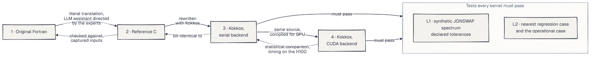

`porting-validation-ladder` · [source](../../course/13-bulk-porting-with-agents.md) · [PDF](mermaid/porting-validation-ladder.pdf) · [report a mistake](https://github.com/h0ffmann/ww3-gpu/issues/new?title=Figure%20porting-validation-ladder%3A%20)

### How do the original Fortran routine and its Kokkos kernel coexist in one WW3 binary?

The GPU code is added next to the original Fortran, not in place of it; a switch read at run time picks which one runs, so both are tested with the same executable.

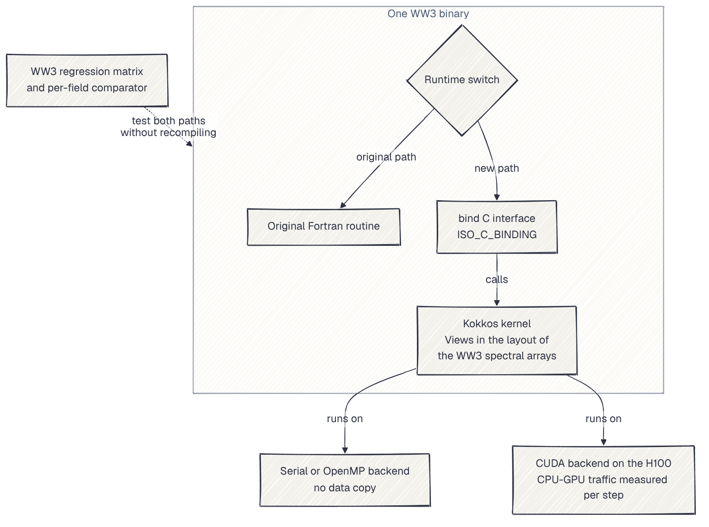

`kokkos-interop-one-binary` · [source](../../course/13-bulk-porting-with-agents.md) · [PDF](mermaid/kokkos-interop-one-binary.pdf) · [report a mistake](https://github.com/h0ffmann/ww3-gpu/issues/new?title=Figure%20kokkos-interop-one-binary%3A%20)

### Which gate must each optimisation step pass before the next step starts?

The project tries cheap changes before expensive ones, and a change only moves on if the forecast it produces still matches the reference within the agreed tolerances and, in step 4, if it is measurably faster.

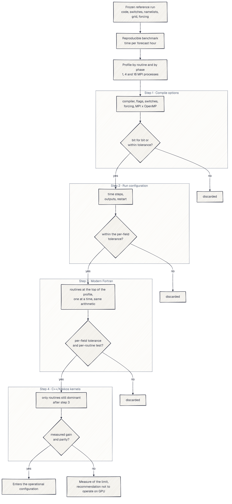

`optimisation-ladder-gates` · [source](../../course/13-bulk-porting-with-agents.md) · [PDF](mermaid/optimisation-ladder-gates.pdf) · [report a mistake](https://github.com/h0ffmann/ww3-gpu/issues/new?title=Figure%20optimisation-ladder-gates%3A%20)

### When does a C++/Kokkos kernel enter the operational configuration?

A rewritten piece of the model is used for real forecasts only if its results agree with the original's within the agreed tolerances and it makes the whole forecast faster on the GPU.

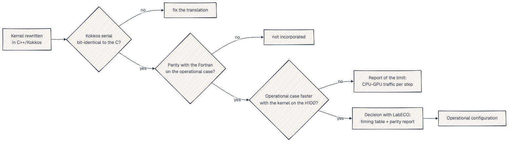

`gpu-operation-decision` · [source](../../course/13-bulk-porting-with-agents.md) · [PDF](mermaid/gpu-operation-decision.pdf) · [report a mistake](https://github.com/h0ffmann/ww3-gpu/issues/new?title=Figure%20gpu-operation-decision%3A%20)

## [`docs/W3SDS4_TRITON_202610.md`](../../docs/W3SDS4_TRITON_202610.md)

### Where does the source-term time go, and how much of it is W3SDS4?

In this test, the routine that dissipates wave energy by breaking (`W3SDS4`) takes two thirds of the source-term time, about five times the nonlinear interaction (`W3SNL1`); with its cumulative-breaking term switched off it costs a quarter as much.

`sds4-profile-ts1` · [source](../../docs/W3SDS4_TRITON_202610.md) · [PDF](mermaid/sds4-profile-ts1.pdf) · [report a mistake](https://github.com/h0ffmann/ww3-gpu/issues/new?title=Figure%20sds4-profile-ts1%3A%20)

### Which branch of the cumulative-breaking term does W3SDS4 run, and what does each cost?

One number in the ST4 settings picks one of three versions of the same term, and the default picks the most expensive one, which WW3's own comment calls "the expensive and largely useless version".

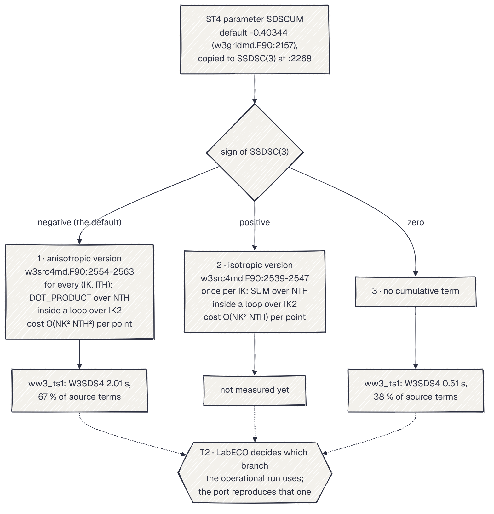

`sds4-sdscum-branches` · [source](../../docs/W3SDS4_TRITON_202610.md) · [PDF](mermaid/sds4-sdscum-branches.pdf) · [report a mistake](https://github.com/h0ffmann/ww3-gpu/issues/new?title=Figure%20sds4-sdscum-branches%3A%20)

### In what order is W3SDS4 ported to Triton, and what gate does each step pass?

The slowest routine is rewritten for a new GPU language in small, checked steps, and nothing is timed until its answers match the original within a stated tolerance.

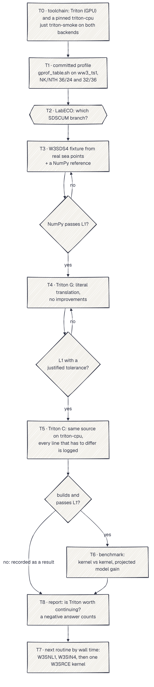

`triton-port-plan` · [source](../../docs/W3SDS4_TRITON_202610.md) · [PDF](mermaid/triton-port-plan.pdf) · [report a mistake](https://github.com/h0ffmann/ww3-gpu/issues/new?title=Figure%20triton-port-plan%3A%20)

### Which implementations of W3SDS4 are timed, and when does a timing count?

Five versions of the same routine get the same input, and only those whose results agree with the original Fortran are allowed into the speed comparison.

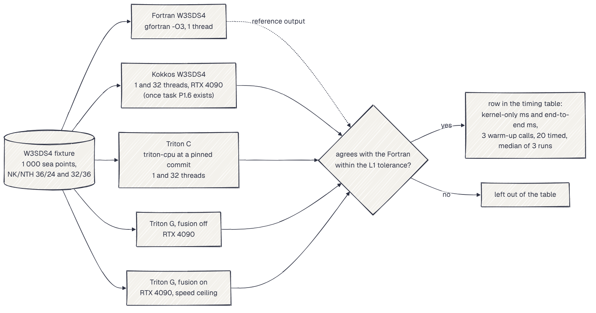

`triton-benchmark-arms` · [source](../../docs/W3SDS4_TRITON_202610.md) · [PDF](mermaid/triton-benchmark-arms.pdf) · [report a mistake](https://github.com/h0ffmann/ww3-gpu/issues/new?title=Figure%20triton-benchmark-arms%3A%20)

### How does WeatherNext 3 enter the benchmark, and what are the waves compared with?

WeatherNext 3 does not forecast waves: it supplies the wind that drives WW3, so the same wave model can be run with a different wind, and each of its 64 ensemble members becomes one WW3 run. The machine-learning wave forecast in the comparison is ECMWF's AIFS Single Wave.

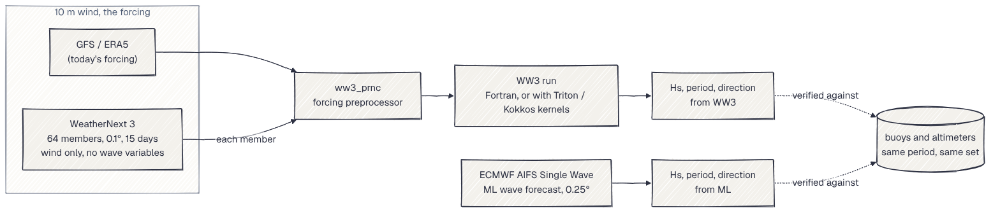

`weathernext-wind-chain` · [source](../../docs/W3SDS4_TRITON_202610.md) · [PDF](mermaid/weathernext-wind-chain.pdf) · [report a mistake](https://github.com/h0ffmann/ww3-gpu/issues/new?title=Figure%20weathernext-wind-chain%3A%20)

## [`pubs/proposal/mapas-mentais.pt.md`](../../pubs/proposal/mapas-mentais.pt.md)

### Do que trata a proposta, em um único mapa?

O projeto mede quanto tempo o WW3 leva para produzir a previsão de ondas do LabECO e reduz esse tempo em quatro etapas, aceitando só as mudanças cujos resultados fiquem dentro das tolerâncias acordadas com o laboratório.

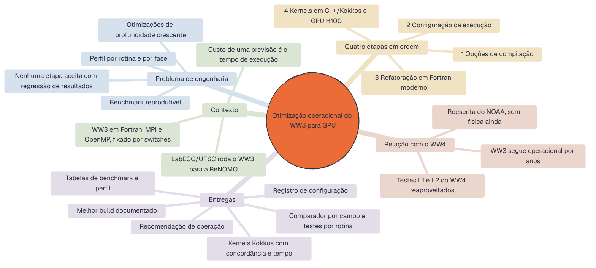

`proposta-visao-geral` · [source](../../pubs/proposal/mapas-mentais.pt.md) · [PDF](mermaid/proposta-visao-geral.pdf) · [report a mistake](https://github.com/h0ffmann/ww3-gpu/issues/new?title=Figure%20proposta-visao-geral%3A%20)

### Que critério cada etapa de otimização precisa cumprir antes da seguinte?

As otimizações vão da mais barata (opções de compilação) à mais cara (reescrita para GPU), e cada alteração só avança se os resultados continuarem concordando com a execução de referência e, na etapa 4, se houver ganho medido.

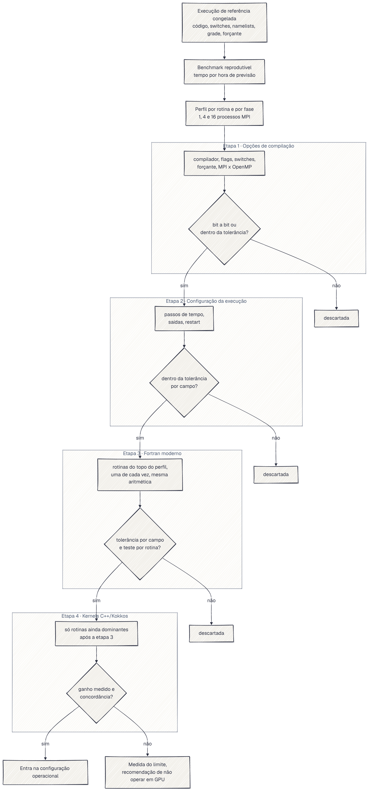

`proposta-escada-otimizacao` · [source](../../pubs/proposal/mapas-mentais.pt.md) · [PDF](mermaid/proposta-escada-otimizacao.pdf) · [report a mistake](https://github.com/h0ffmann/ww3-gpu/issues/new?title=Figure%20proposta-escada-otimizacao%3A%20)

### Quando um kernel em GPU entra na configuração operacional?

Uma rotina reescrita para GPU só passa a ser usada nas previsões se seus resultados concordarem com os da original dentro das tolerâncias e se ela tornar a previsão completa mais rápida no H100.

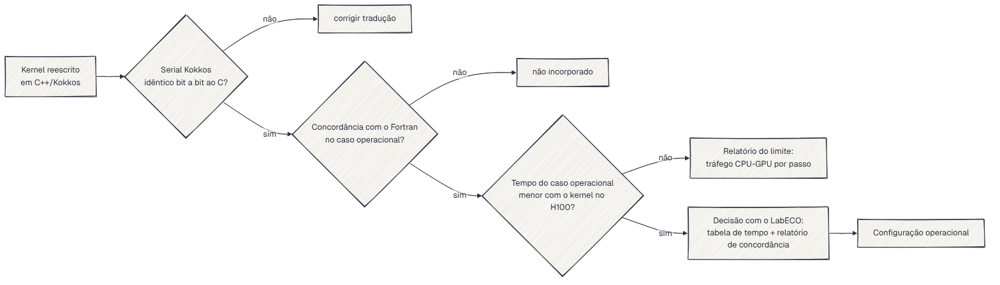

`proposta-decisao-operacao` · [source](../../pubs/proposal/mapas-mentais.pt.md) · [PDF](mermaid/proposta-decisao-operacao.pdf) · [report a mistake](https://github.com/h0ffmann/ww3-gpu/issues/new?title=Figure%20proposta-decisao-operacao%3A%20)

### Que testes o WW3 e o WW4 ofereciam em setembro e outubro de 2026, e o que o projeto acrescenta?

O WW3 só informa se duas execuções são idênticas ou não, e o WW4 ainda não tem testes do modelo completo; o projeto constrói o comparador com tolerâncias e os testes por rotina que faltam.

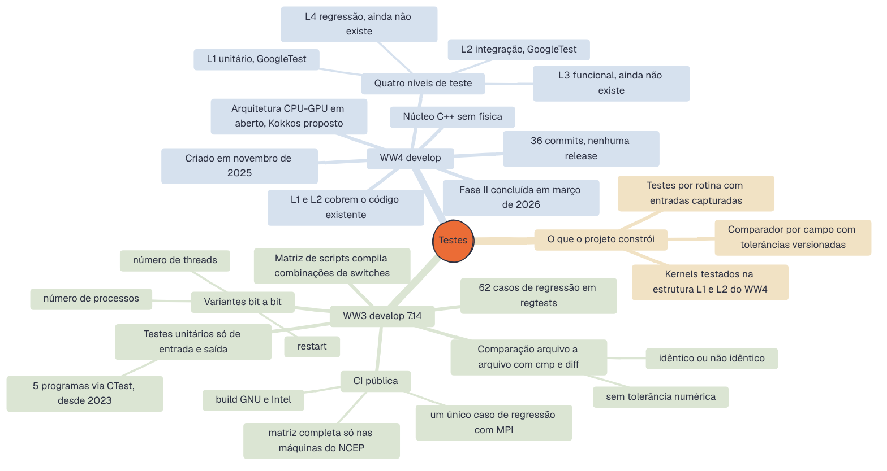

`testes-ww3-ww4` · [source](../../pubs/proposal/mapas-mentais.pt.md) · [PDF](mermaid/testes-ww3-ww4.pdf) · [report a mistake](https://github.com/h0ffmann/ww3-gpu/issues/new?title=Figure%20testes-ww3-ww4%3A%20)

### Como a rotina original em Fortran e o kernel em Kokkos convivem em um único executável?

O código novo em C++/Kokkos entra ao lado do Fortran original, e não no lugar dele; uma chave lida durante a execução escolhe qual dos dois roda, e os dois caminhos são testados com o mesmo executável.

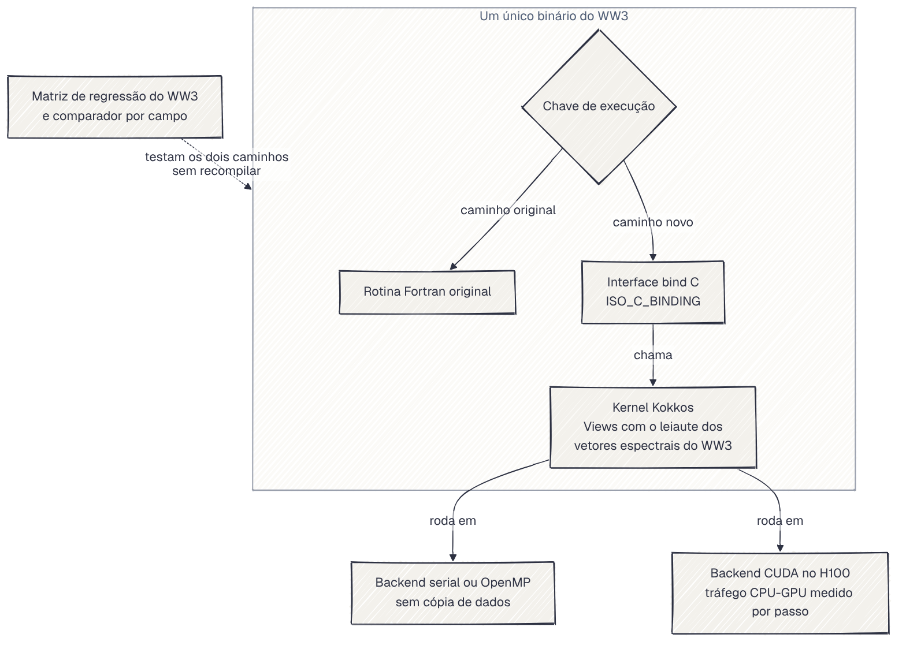

`proposta-interoperabilidade` · [source](../../pubs/proposal/mapas-mentais.pt.md) · [PDF](mermaid/proposta-interoperabilidade.pdf) · [report a mistake](https://github.com/h0ffmann/ww3-gpu/issues/new?title=Figure%20proposta-interoperabilidade%3A%20)

### Como cada versão traduzida é verificada contra a anterior?

O Fortran é traduzido para C e depois para C++/Kokkos em passos pequenos, e cada versão é verificada contra a anterior: o Kokkos serial deve ser idêntico bit a bit ao C, e a versão em GPU é comparada estatisticamente com a de CPU.

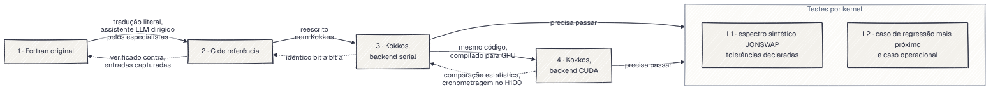

`proposta-validacao-traducao` · [source](../../pubs/proposal/mapas-mentais.pt.md) · [PDF](mermaid/proposta-validacao-traducao.pdf) · [report a mistake](https://github.com/h0ffmann/ww3-gpu/issues/new?title=Figure%20proposta-validacao-traducao%3A%20)

### Quando acontece cada etapa do projeto?

O projeto ocupa dois períodos letivos, de outubro de 2026 a abril de 2027, com uma atividade por mês e a defesa a partir de maio de 2027.

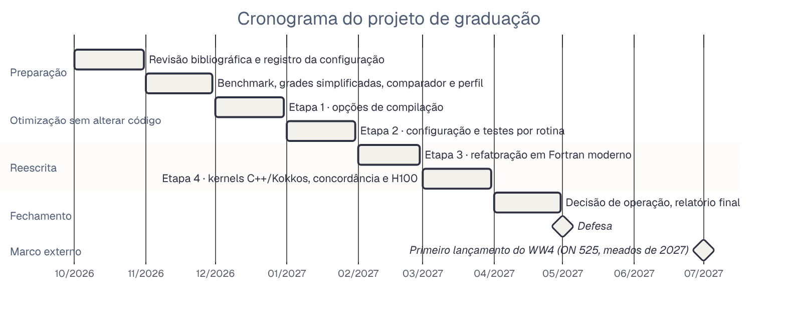

`proposta-cronograma` · [source](../../pubs/proposal/mapas-mentais.pt.md) · [PDF](mermaid/proposta-cronograma.pdf) · [report a mistake](https://github.com/h0ffmann/ww3-gpu/issues/new?title=Figure%20proposta-cronograma%3A%20)

### Quais são os riscos do projeto e como cada um é mitigado?

São quatro riscos, e para cada um a proposta já define a resposta: testes contra divergências, ordem fixa das etapas, medida do limite imposto pela transferência CPU–GPU e substitutos provisórios para atrasos.

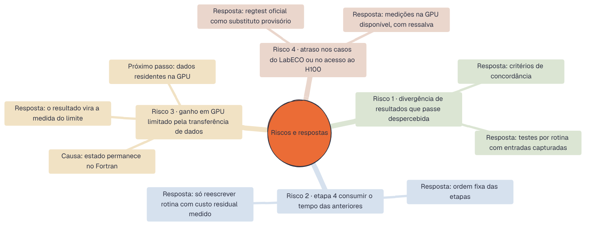

`proposta-riscos` · [source](../../pubs/proposal/mapas-mentais.pt.md) · [PDF](mermaid/proposta-riscos.pdf) · [report a mistake](https://github.com/h0ffmann/ww3-gpu/issues/new?title=Figure%20proposta-riscos%3A%20)
