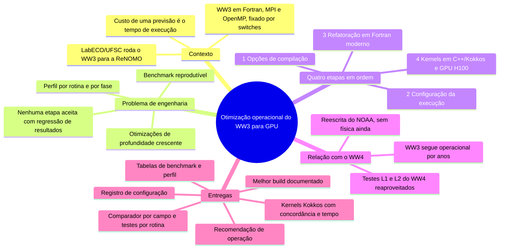
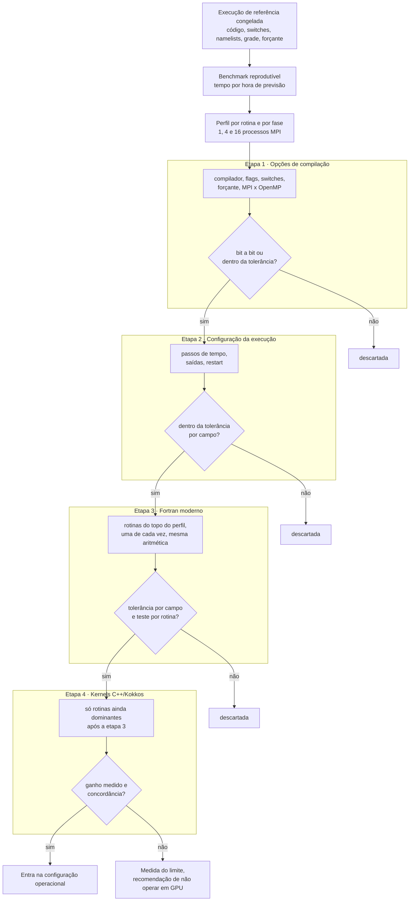
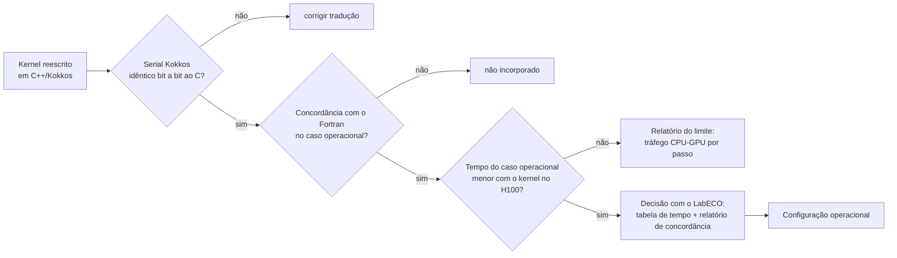
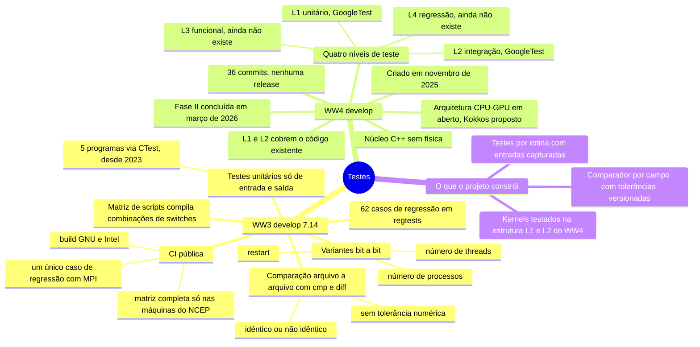
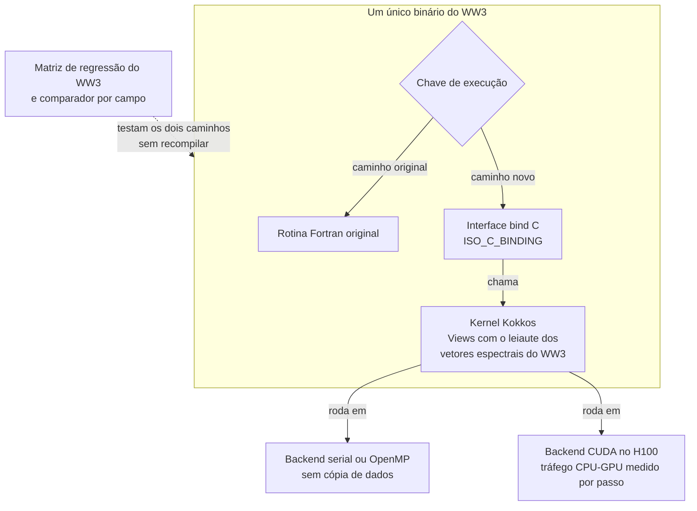
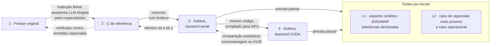
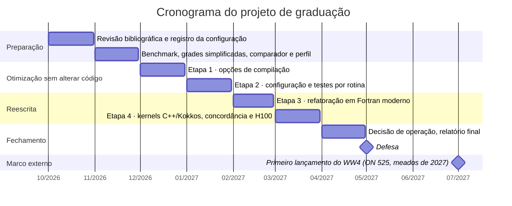
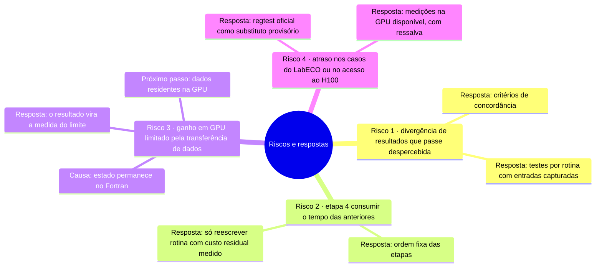

# Mapas mentais da proposta (PT-BR)

Diagramas Mermaid que resumem a Proposta de Projeto de Graduação em `pubs/proposal/pt/`.
O GitHub renderiza os blocos abaixo diretamente; localmente, qualquer visualizador Mermaid serve.
Cada diagrama traz, logo abaixo, um quadro *Como ler esta figura* para quem chega ao tema agora,
e a galeria [`pubs/figures/`](../figures/README.md) reúne as versões renderizadas.

## 1. Visão geral da proposta

Como ler esta figura

**Em uma frase.** O projeto mede quanto tempo o WW3 leva para produzir a previsão de ondas do LabECO e reduz esse tempo em quatro etapas, aceitando só as mudanças cujos resultados fiquem dentro das tolerâncias acordadas com o laboratório.

**Como ler.** O centro é o tema; cada ramo é uma parte da proposta, e as folhas resumem o que o texto diz sobre ela. Só o ramo das etapas tem ordem: elas são numeradas na sequência em que serão executadas.

**Fora da figura.** Os números citados no texto e as referências; o mapa resume a estrutura da proposta, não resultados.

**Evidência.** Capítulos `pt/03-theme.md` a `pt/07-methodology.md` (v).

## 2. A escada de otimização e os critérios de concordância

Como ler esta figura

**Em uma frase.** As otimizações vão da mais barata (opções de compilação) à mais cara (reescrita para GPU), e cada alteração só avança se os resultados continuarem concordando com a execução de referência e, na etapa 4, se houver ganho medido.

**Como ler.** De cima para baixo. As três caixas do topo fixam a referência e os instrumentos de medida (*benchmark* e perfil). Cada grupo é uma etapa: à esquerda, o que muda; à direita, o losango com o critério de aceite. Um *sim* leva à etapa seguinte; um *não* descarta a alteração nas etapas 1 a 3 e, na etapa 4, leva ao relatório do limite.

**Fora da figura.** Os valores das tolerâncias, que o grupo de pesquisa do LabECO definirá para cada campo, e o retorno da alteração reprovada à reescrita.

**Evidência.** `pt/04-scope.md` (as quatro etapas) e `pt/07-methodology.md`, parágrafo *Critérios de concordância e ordem dos testes* (v).

## 3. Decisão de operação para um kernel em GPU

Como ler esta figura

**Em uma frase.** Uma rotina reescrita para GPU só passa a ser usada nas previsões se seus resultados concordarem com os da original dentro das tolerâncias e se ela tornar a previsão completa mais rápida no H100.

**Como ler.** Da esquerda para a direita. Cada losango é um teste, feito nessa ordem; um *não* termina em uma caixa que diz o que acontece no lugar, e só três respostas *sim* levam à decisão com o LabECO.

**Fora da figura.** As tolerâncias de cada campo e o protocolo de medição de tempo (pelo menos cinco repetições, mediana e intervalo interquartil).

**Evidência.** `pt/07-methodology.md`: o parágrafo de abertura (protocolo de tempo) e os parágrafos *Interoperabilidade e testes dos kernels* e *Riscos* (v).

## 4. Testes hoje: WW3 e WW4 (levantamento de 15/09/2026)

Como ler esta figura

**Em uma frase.** O WW3 só informa se duas execuções são idênticas ou não, e o WW4 ainda não tem testes do modelo completo; o projeto constrói o comparador com tolerâncias e os testes por rotina que faltam.

**Como ler.** Três ramos saem do centro: o WW3, o WW4 e o que o projeto constrói. As folhas são fatos do levantamento, e as mais externas detalham a folha de onde saem.

**Fora da figura.** Os nomes dos casos de regressão e dos programas de teste. O levantamento do WW3 é de 15/09/2026 e o do WW4, de 07/10/2026; o estado do WW4 pode ter mudado desde então.

**Evidência.** `pt/05-justification.md`, parágrafos *Estado dos testes do WW3* e *Estado do WW4* (v). ⚠ Quatro folhas não estão nesses parágrafos: "36 commits, nenhuma release", no ramo do WW4, e as três folhas de "CI pública", no ramo do WW3; vêm do levantamento e não foram reverificadas.

## 5. Interoperabilidade Fortran e Kokkos

Como ler esta figura

**Em uma frase.** O código novo em C++/Kokkos entra ao lado do Fortran original, e não no lugar dele; uma chave lida durante a execução escolhe qual dos dois roda, e os dois caminhos são testados com o mesmo executável.

**Como ler.** A caixa grande é um único executável do WW3. O losango é a chave de execução; suas duas setas são os caminhos que uma chamada pode seguir, o Fortran original ou o novo, pela interface em C até o kernel em Kokkos. Abaixo da caixa, o mesmo kernel roda em CPU ou em GPU. A seta tracejada é o teste: a matriz de regressão e o comparador exercitam os dois caminhos do mesmo executável.

**Fora da figura.** A alternativa de manter os dados na GPU entre um passo de tempo e outro, que a proposta deixa para trabalho futuro (parágrafo *Riscos*).

**Evidência.** `pt/07-methodology.md`, parágrafo *Interoperabilidade e testes dos kernels* (v).

## 6. Validação em escada da tradução (receita do FESOM2)

Como ler esta figura

**Em uma frase.** O Fortran é traduzido para C e depois para C++/Kokkos em passos pequenos, e cada versão é verificada contra a anterior: o Kokkos serial deve ser idêntico bit a bit ao C, e a versão em GPU é comparada estatisticamente com a de CPU.

**Como ler.** As caixas numeradas são quatro versões da mesma rotina, feitas nessa ordem. A seta contínua diz como a versão seguinte é escrita; a seta tracejada aponta de volta para a versão contra a qual ela é verificada, e o rótulo diz o rigor da verificação. As duas versões em Kokkos também precisam passar nos testes L1 e L2 do quadro *Testes por kernel*, que segue a estrutura de testes do WW4.

**Fora da figura.** As tolerâncias de cada teste e o atalho usado no `W3SNL1`, em que a etapa em C foi dispensada e o Kokkos serial foi comparado diretamente com o Fortran (`course/12-porting-a-kernel-w3snl1.md`).

**Evidência.** `pt/07-methodology.md`, parágrafo *Interoperabilidade e testes dos kernels*, que segue Koldunov et al. (2026) (v).

## 7. Cronograma

Como ler esta figura

**Em uma frase.** O projeto ocupa dois períodos letivos, de outubro de 2026 a abril de 2027, com uma atividade por mês e a defesa a partir de maio de 2027.

**Como ler.** O eixo horizontal é o tempo, em meses; cada barra é uma atividade, e cada seção agrupa atividades afins. Os marcos (losangos, sem duração) são a defesa e, como referência externa, o primeiro lançamento previsto do WW4.

**Fora da figura.** Os ajustes de datas com os orientadores, que o texto prevê.

**Evidência.** Tabela de `pt/08-schedule.md` (v); o marco do WW4 vem de `pt/05-justification.md`, que o situa em meados de 2027 (v). ⚠ Os dias 01/05/2027 (a defesa ocorre "a partir de" maio) e 01/07/2027 são só a posição no gráfico.

## 8. Riscos e mitigações

Como ler esta figura

**Em uma frase.** São quatro riscos, e para cada um a proposta já define a resposta: testes contra divergências, ordem fixa das etapas, medida do limite imposto pela transferência CPU–GPU e substitutos provisórios para atrasos.

**Como ler.** Cada ramo é um risco, numerado do principal ao quarto, na ordem do texto. As folhas dizem o que o projeto fará a respeito (*Resposta*); no risco 3, uma folha dá a causa e outra, o passo seguinte ao projeto.

**Fora da figura.** A probabilidade e o impacto de cada risco, que o texto não quantifica.

**Evidência.** `pt/07-methodology.md`, parágrafo *Riscos* (v).

