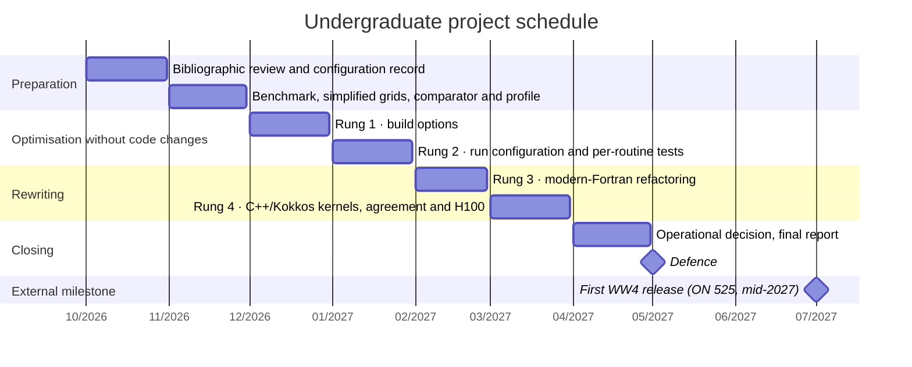

# Proposal schedule (EN)

The English copy of the schedule figure in [`mapas-mentais.pt.md`](mapas-mentais.pt.md#7-cronograma),
drawn from the table in [`en/08-schedule.md`](en/08-schedule.md). In the proposal's PDF and Word
files, that table is drawn as a month grid by [`../filters/cronograma.lua`](../filters/cronograma.lua),
in both languages.

How to read this figure

**Takeaway.** The project takes two academic periods, from October 2026 to April 2027, with one activity per month and the defence from May 2027.

**How to read.** Time runs left to right, in months; each bar is an activity, and each section groups related activities. The milestones (diamonds, no duration) are the defence and, as an outside reference, the expected first WW4 release.

**Not shown.** The date adjustments with the advisors that the text allows for.

**Evidence.** Table in `en/08-schedule.md` (v), against which `scripts/figures.py check` verifies the start month of each activity and the defence milestone; the WW4 milestone comes from `en/05-justification.md`, which places it in mid-2027 (v). ⚠ The days 2027-05-01 (the defence is "from" May) and 2027-07-01 only position the marks on the chart.

